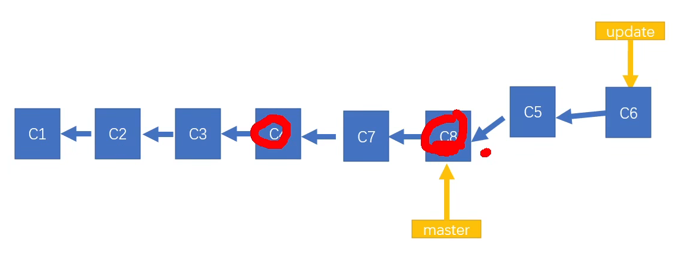

## 一、安装

阿里的git镜像站：[https://npm.taobao.org/mirrors/git-for-windows/](https://npm.taobao.org/mirrors/git-for-windows/)，下载安装即可

## 二、配置

配置 name 和 email（标识自己身份）

```bash
git config --global user.name "xxxx"
git config --global user.email "xxx@xxx.xxx"
```

查看当前的Git配置

```bash
git config --list
```

## 三、使用 git

### 1. 查看当前仓库的状态

```sh
git status
```

### 2. 初始化仓库

```sh
git init
```

### 3. 文件状态

1. 未跟踪

   - 文件没有被git所管理

2. 已跟踪

   文件已经被git所管理

   - 暂存，文件修改已经保存，但是尚未提交到git仓库
   - 未修改，表示磁盘中的文件和git仓库中的文件相同，没有修改
   - 已修改，表示磁盘中的文件已被修改，和git仓库中文件不同
   - 可以使用`git status`来查看文件的状态

3. 未跟踪 → 暂存

    ```bash
    git add <filename> 将文件切换到暂存的状态
    git add * 将所有已修改（未跟踪）的文件暂存
    ```

4. 暂存 → 未修改（将本地修改的代码提交到仓库与之同步）

    ```bash
    git commit -m "xxxx" 将暂存的文件存储到仓库中
    git commit -a -m "xxxx" 提交所有已修改的文件（未跟踪的文件不会提交）
    ```

5. 未修改 → 修改

    - 修改代码后，文件会变为修改状态


### 4. 常用的命令

1. 重置文件

```bash
git restore <filename> # 恢复文件
git restore --staged <filename> # 取消暂存状态（不取消操作）
```

2. 删除文件

```bash
git rm <filename> # 删除文件
git rm <filename> -f # 强制删除
```

3. 移动文件

```bash
git mv from to # 移动文件 重命名文件
```

## 四、分支

### 1. 基本操作

git 在存储文件时，每一次代码的提交都会创建一个与之对应的节点（==存档==），git 就是通过一个一个的节点来记录代码的状态的。节点会构成一个树状结构，树状结构就意味着这个树会存在分支，默认情况下仓库只有一个分支，命名为 ==master==。在使用 git 时，可以创建多个分支，分支与分支之间相互独立，在一个分支上修改代码不会影响其他的分支。

```bash
git branch # 查看当前分支

# 在新的分支上完成功能
git branch <branch name> # 创建新的分支
git switch <branch name> # 切换分支
git switch -c <branch name> # 创建并切换分支

# 当功能开发完成时首先切回主分支，然后合并新开发功能的分支
# 测试没有问题后，将原有开发分支删除
git merge <branch name> # 和并分支
git branch -d <branch name> # 删除分支
```

在开发中，都是在自己的分支上编写代码，代码编写完成后，再将自己的分支合并到主分支中。

### 2. 变基（rebase）

在开发中除了通过 merge 来合并分支外，还可以通过变基来完成分支的合并。

我们通过 merge 合并分支时，在提交记录中会将所有的分支创建和分支合并的过程全部都显示出来，这样当项目比较复杂，开发过程比较波折时，我必须要反复的创建、合并、删除分支。这样一来将会使得我们代码的提交记录变得极为混乱。

```sh
 git rebase master
```

原理（变基时发生了什么）：

1. 当我们发起变基时，git 会首先找到两条分支的最近的共同祖先
2. 对比当前分支相对于祖先的历史提交，并且将它们提取出来存储到一个临时文件中
3. 将当前部分指向目标的基底
4. 以当前基底开始，重新执行历史操作

> 先将自己分支上的修改保存起来，在主分支新的代码之后重新进行这些操作（自己的改变先按兵不动，将新的代码拿过来再尝试将自己的修改应用到新代码中）



变基和 merge 对于合并分支来说最终的结果是一样的！但是变基会使得代码的提交记录更整洁更清晰！注意！大部分情况下合并和变基是可以互换的，==但是如果分支已经提交给了远程仓库，那么这时尽量不要变基==。

## 五、远程仓库（remote）

目前我们对于 git 所有操作都是在本地进行的。在开发中显然不能这样的，这时我们就需要一个远程的 git 仓库。远程的 git 仓库和本地的本质没有什么区别，不同点在于远程的仓库可以被多人同时访问使用，方便我们协同开发。在实际工作中，git 的服务器通常由公司搭建内部使用或是购买一些公共的私有 git 服务器。我们学习阶段，直接使用一些开放的公共 git 仓库。目前我们常用的库有两个：GitHub 和 Gitee（码云）

>  将本地库上传 git：

```bash
git remote add origin https://github.com/lilichao/git-demo.git
# git remote add <remote name> <url>

git branch -M main
# 修改分支的名字的为main

git push -u origin main
# git push [remote] [branch]
# git push 将代码上传服务器上
```

>  将本地库上传 gitee：

```bash
git remote add gitee https://gitee.com/ymhold/vue-course.git
git push -u gitee main
```

### 1. 远程库的操作的命令

```bash
git remote # 列出当前的关联的远程库
git remote add <远程库名> <url> # 关联远程仓库
git remote remove <远程库名>  # 删除关联的远程库
git push -u <远程库名> <分支名> # 向远程库推送代码，并和当前分支关联
git push <远程库> <本地分支>:<远程分支>
git clone <url> # 从远程库下载代码

git push # 如果本地的版本低于远程库，push默认是推不上去
git fetch # 要想推送成功，必须先确保本地库和远程库的版本一致，fetch它会从远程仓库下载所有代码，但是它不会将代码和当前分支自动合并
# 使用fetch拉取代码后，必须要手动对代码进行合并
git merge <远程库名/远程分支>

git pull  # 从服务器上拉取代码并自动合并

```

注意：推送代码之前，一定要先从远程库中拉取最新的代码

### 2. tag 标签

-   当头指针没有执行某个分支的头部时，这种状态我们称为分离头指针（HEAD detached），分离头指针的状态下也可以操作代码，但是这些操作不会出现在任何的分支上，所以注意不要再分离头指针的状态下来操作仓库。

-   如果非得要回到后边的节点对代码进行操作，则可以选择创建分支后再操作

    ```bash
    git switch -c <分支名> <提交id>
    ```

-   可以为提交记录设置标签，设置标签以后，可以通过标签快速的识别出不同的开发节点：

    ```bash
    git tag
    git tag 版本
    git tag 版本 提交id
    git push 远程仓库 标签名
    git push 远程仓库 --tags
    git tag -d 标签名 # 删除标签
    git push 远程仓库 --delete 标签名 # 删除远程标签
    ```


### 3. gitignore

- 默认情况下，git 会监视项目中所有内容，但是有些内容比如 node_modules 目录中的内容，我们不希望它被 git 所管理。我们可以在项目目录中添加一个`.gitignore`文件，来设置那些需要 git 忽略的文件。

- ```
  # Numerous always-ignore extensions  
  *.bak  
  *.patch  
  *.diff  
  *.err  
  
  # temp file for git conflict merging  
  *.orig  
  *.log  
  *.rej  
  *.swo  
  *.swp  
  *.zip  
  *.vi  
  *~  
  *.sass-cache  
  *.tmp.html  
  *.dump  
  
  # OS or Editor folders  
  .DS_Store  
  ._*  
  .cache  
  .project  
  .settings  
  .tmproj  
  *.esproj  
  *.sublime-project  
  *.sublime-workspace  
  nbproject  
  thumbs.db  
  *.iml  
  
  # Folders to ignore  
  .hg  
  .svn  
  .CVS  
  .idea  
  node_modules/  
  jscoverage_lib/  
  bower_components/  
  dist/  
  ```

### 4. github 的静态页面

-   在 github 中，可以将自己的静态页面直接部署到 github 中，它会给我们提供一个地址使得我们的页面变成一个真正的网站，可以供用户访问。
-   要求：
    -   静态页面的分支必须叫做：gh-pages
    -   如果希望页面可以通过 xxx.github.io 访问，则需要将库的名字配置为 xxx.github.io

## 六、常规工作流

将远程仓库复制到本地

```bash
git clone https://github.com/example/example.git
```

新建一个自己的分支

```bash
git checkout -b my-feature
 or
git switch -c my-feature
```

修改代码（添加功能、修改bug...），此时可以通过下述命令查看代码变化（==非必须==）

```bash
git diff
```

添加改变到暂存区

```bash
git add <changed_file>
```

将改变提交到本地git仓库

```bash
git commit -m 'fix xxx'
```

如果此时远程仓库没有更新，可以将改变提交到远程仓库

```bash
git push origin my-feature
```

---

如果此时远程仓库存在更新，则本地的版本低于远程库，push默认推不上去，此时需要先同步远程仓库的变化

```bash
git checkout main 
// git switch main
git pull origin master 
```

然后切回自己的分支合并自己的修改与最新代码，当出现冲突的时候选择需要保留的代码

```
git checkout my-feature 
// git switch my-feature
git rebase main
```

最后将做出的修改推送到远程仓库

```
git push -f origin my-feature
```

请求pull request

---

仓库维护者审查代码之后执行squash and merge，将分支上的改变合并为一个改变并合并，删除远程分支

---

我们同样要删除本地的分支并拉取最新的代码

```bash
git branch -D my-feature
git pull origin master
```

