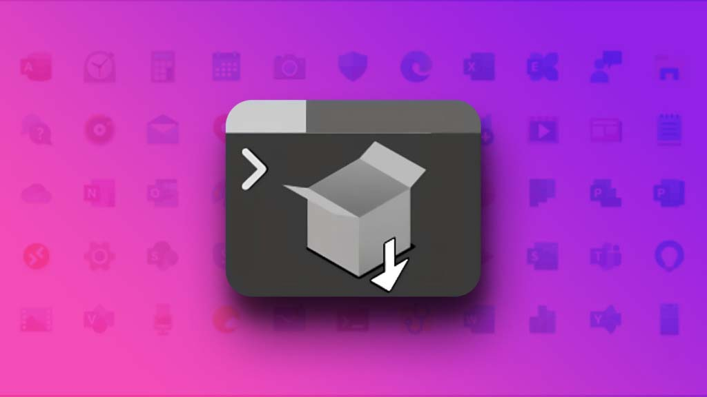
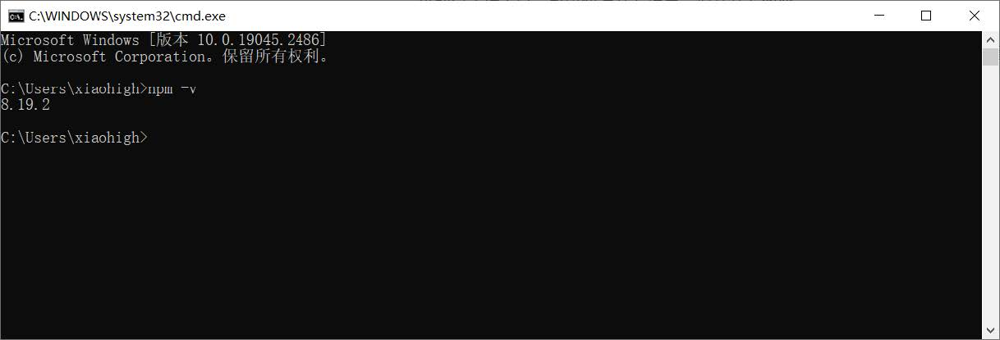
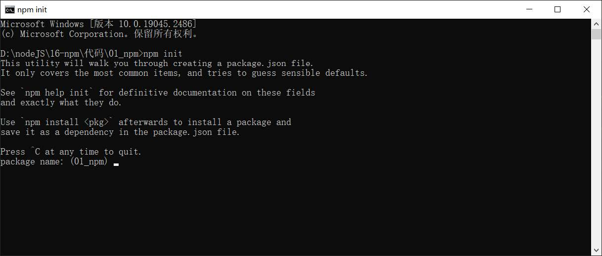

## 一、概念介绍

### 1. 包是什么

> 『包』英文单词是 `package` ，代表了一组特定功能的源码集合，就是将一些预先设计好的功能或者说 API 封装到一个文件夹，提供给开发者使用。

### 2. 包管理工具

管理『包』的应用软件，可以对「包」进行 `下载安装` ， `更新` ， `删除`， `上传`等操作

借助包管理工具，可以快速开发项目，提升开发效率

包管理工具是一个通用的概念，很多编程语言都有包管理工具，所以 <span style="color:red">掌握好包管理工具非常重要</span>

### 3. 包加载的基本流程

nodejs 对 npm 支持非常良好

当使用 nodejs 导入模块时，如果模块路径不是以 ./ 或 ../ 开头，则 node 会认为导入的模块来自于 node_modules 目录，例如：

```js
var _ = require("lodash");
```

1. 优先在当前文件夹下 node_modules 中寻找同名的文件夹
   - 找到该第三方包中的`package.json`文件，并且找到里面的`main`属性对应的入口模块，该入口模块即为加载的第三方模块。
   - 如果在要加载的第三方包中没有找到`package.json`文件或者是`package.json`文件中没有`main`属性，则默认加载第三方包中的`index.js`文件。
   - 如果在加载第三方模块的文件的同级目录没有找到`node_modules`文件夹，或者以上所有情况都没有找到，则跳到第2步继续查找。
2. 在上级目录中下的 node_modules 中寻找同名的文件夹，直至找到磁盘根目录，如果一直找到该模块的磁盘根路径都没有找到，则会报错：`can not find module xxx`。

### 3. 常用的包管理工具

下面列举了前端常用的包管理工具

- `npm`
- yarn
- cnpm

## 二、npm

> npm 全称 `Node Package Manager` ，翻译为中文意思是『Node 的包管理工具』

npm 是 node.js 官方内置的包管理工具，是 <span style="color:red">必须要掌握住的工具</span>

### 1. npm 的安装

node.js 在安装时会 `自动安装 npm` ，所以如果你已经安装了 node.js，可以直接使用 npm

可以通过 `npm -v` 查看版本号测试，如果显示版本号说明安装成功，反之安装失败



> 查看版本时可能与上图版本号不一样，不过不影响正常使用

### 2. npm 基本使用

#### 初始化

创建一个空目录，然后以此目录作为工作目录 <span style="color:red">启动命令行工具</span>，执行 `npm init`



`npm init` 命令的作用是将文件夹初始化为一个『包』， `交互式创建 package.json 文件`

`package.json` 是包的配置文件，每个包都必须要有 `package.json`

`package.json` 内容示例：

```json
{
	"name": "01_npm",
	"version": "1.0.0",
	"description": "",
	"main": "index.js",
	"scripts": {
		"test": "echo \"Error: no test specified\" && exit 1"
	},
	"author": "",
	"license": "ISC"
}
```

属性翻译

```json
{
	"name": "1-npm", 		#包的名字
	"version": "1.0.0", 	#包的版本
	"description": "", 		#包的描述
	"main": "index.js", 	#包的入口文件
	"scripts": { 		    #脚本配置
		"test": "echo \"Error: no test specified\" && exit 1"
	},
	"author": "", 			#作者
	"license": "ISC" 		#开源证书
}
```

> 初始化的过程中还有一些注意事项：
>
> 1. package name (`包名`) 不能使用中文、大写，默认值是`文件夹的名称`，所以文件夹名称也不能使用中文和大写
> 2. version (`版本号`)要求 `x.x.x` 的形式定义，`x` 必须是数字，默认值是 `1.0.0`
> 3. ISC 证书与 MIT 证书功能上是相同的，关于开源证书扩展阅读 http://www.ruanyifeng.com/blog/2011/05/how_to_choose_free_software_licenses.html
> 4. `package.json` 可以手动创建与修改
> 5. 使用 `npm init -y` 或者 `npm init --yes` 极速创建 `package.json`

#### 搜索包

搜索包的方式有两种

1. 命令行 『npm s/search 关键字』

2. `网站搜索` 网址是 `https://www.npmjs.com/`（推荐）

#### 下载安装包

我们可以通过 `npm install` 和 `npm i` 命令安装包

```shell
# 格式
npm install <包名>
npm i <包名>

# 示例
npm install uniq
npm i uniq
```

运行之后文件夹下会增加两个资源

- `node_modules 文件夹` 存放下载的包
- `package-lock.json 包的锁文件`，用来锁定包的版本

>安装 uniq 之后， uniq 就是当前这个包的一个 `依赖包` ，有时会简称为 `依赖`
>
>比如我们创建一个包名字为 A，A 中安装了包名字是 B，我们就说 <span style="color:red">B 是 A 的一个依赖包</span>，也会说 <span style="color:red">A 依赖 B</span>
>
> 如果本地安装的包带有 CLI，npm 会将它的 CLI 脚本文件放置到`node_modules/.bin`下，使用命令`npx 命令名`即可调用

### 3. 配置镜像源

由于 npm 默认的下载地址在国外，有时候会被墙，导致无法下载或者下载很慢。因此，我们可以尝试切换成，从其他的镜像源下载 npm 包。

切换镜像源，有下面这几种方式：

- 方式 1：临时切换镜像源。
- 方式 2：切换镜像源
- 方式 3：通过 NRM 切换镜像源（最为推荐的方式）。
- 方式 4：cnpm

#### 直接配置

```sh
npm i express --registry https://registry.npmmirror.com/
```

安装指定包的时候，追加 `--registry`参数。

```sh
npm config set registry https://registry.npmmirror.com/
```

执行上述命令后，以后下载所有 npm 包的时候，都会改为使用淘宝的镜像源。

#### 工具配置

使用 `nrm` 配置 npm 的镜像地址 

1. 安装 nrm

   ```sh
   npm i -g nrm
   ```

2. 查看可选的源

   ```sh
   nrm ls
   ```

3. 修改镜像

   ```sh
   nrm use taobao
   ```

4. 检查是否配置成功（选做）

   ```sh
   npm config list
   ```

   检查 registry 地址是否为 `https://registry.npmmirror.com/` , 如果 `是` 则表明成功

#### 使用cnpm替换npm

### 4. 生产环境与开发环境

`开发环境` 是程序员 <span style="color:red">专门用来写代码</span> 的环境，一般是指程序员的电脑，开发环境的项目一般 <span style="color:red">只能程序员自己访问</span>

`生产环境` 是项目 <span style="color:red">代码正式运行</span> 的环境，一般是指正式的服务器电脑，生产环境的项目一般 <span style="color:red">每个客户都可以访问</span>

如何优雅的让 node 知道处于什么环境，是极其重要的

比如，我们有如下的js代码：

**index.js:**

```js
var a = "没有环境变量";
console.log(process.env.NODE_ENV)
if(process.env.NODE_ENV === "development"){
    a = "开发环境"
}
else if(process.env.NODE_ENV === "production"){
    a = "生产环境"
}
else if(process.env.NODE_ENV === "test"){
    a = "测试环境"
}
console.log(a)
```

这段代码的意思，就是检测系统环境的`NODE_ENV`值，来判定node程序处于何种环境

当然，不同系统环境，配置环境变量各不相同，所以，我们必须使用第三方包来帮助我们进行配置

下载第三方包 `cross-env`，这种使用命令行的，肯定是开发依赖，所以，我们直接下载开发依赖即可

```sh
npm i -D cross-env
```

在`package.json`中加入如下代码

```json
"scripts": {
    "start": "cross-env NODE_ENV=development node index.js",
    "build": "cross-env NODE_ENV=production node index.js",
    "test": "cross-env NODE_ENV=test node index.js"
  },
```

### 5. 生产依赖与开发依赖

我们可以在安装时设置选项来区分 `依赖的类型`，目前分为两类：

| 类型     | 命令                                    | 补充                                                         |
| -------- | --------------------------------------- | ------------------------------------------------------------ |
| 生产依赖 | npm i -S uniq <br/>npm i --save uniq    | -S 等效于 --save，`-S 是默认选项`<br/>包信息保存在 package.json 中 `dependencies` 属性 |
| 开发依赖 | npm i -D less<br/>npm i --save-dev less | -D 等效于 --save-dev<br/>包信息保存在 package.json 中 `devDependencies` 属性 |

> 举个例子方便大家理解，比如说做蛋炒饭需要`大米`，`油`，`葱`，`鸡蛋`，`锅`，`煤气`，`铲子`等
>
> 其中`锅`， `煤气`， `铲子`属于开发依赖，只在制作阶段使用
>
> 而 `大米`， `油`， `葱`， `鸡蛋`属于生产依赖，在制作与最终食用都会用到
>
> 所以 `开发依赖` 是只在开发阶段使用的依赖包，而 `生产依赖` 是开发阶段和最终上线运行阶段都用到的依赖包

### 6. 全局安装

我们可以执行安装选项 -g 进行全局安装

```shell
npm i -g nodemon
```

全局安装完成之后就可以在命令行的任何位置运行 `nodemon` 命令

该命令的作用是 `自动重启 node 应用程序`

> 说明：
>
> - 全局安装的命令不受工作目录位置影响
> - 可以通过 `npm root -g` 可以查看全局安装包的位置
> - <span style="color:red">不是所有的包都适合全局安装</span>，只有全局类的工具才适合，可以通过<span style="color:red">查看包的官方文档来确定安装方式</span>，这里先不必太纠结

### 7. 安装包依赖

在项目协作中有一个常用的命令就是 `npm i`，通过该命令可以依据 `package.json` 和 `package-lock.json` 的依赖声明安装项目依赖

```shell
npm i
npm install
```

> node_modules 文件夹大多数情况都不会存入版本库

### 8. 安装指定版本的包

项目中可能会遇到版本不匹配的情况，有时就需要安装指定版本的包，可以使用下面的命令的

```shell
## 格式
npm i <包名@版本号>

## 示例
npm i jquery@1.11.2
```

### 9. 删除依赖

项目中可能需要删除某些不需要的包，可以使用下面的命令

```shell
## 局部删除
npm remove uniq
npm r uniq

## 全局删除
npm remove -g nodemon
```

### 10. 配置命令别名

通过配置命令别名可以更简单的执行命令

配置 package.json 中的 `scripts` 属性

```json
{
	...
	"scripts": {
		"server": "node server.js",
		"start": "node index.js",
	},
	...
}
```

配置完成之后，可以使用别名执行命令

```shell
npm run server
npm run start
```

不过 `start` 别名比较特别，使用时可以省略 `run`

```shell
npm start
```

> 补充说明：
>
> - `npm start` 是项目中常用的一个命令，一般用来启动项目
> - `npm run` 有自动向上级目录查找的特性，跟 `require` 函数也一样
> - 对于陌生的项目，我们可以通过查看 `scripts` 属性来参考项目的一些操作

### 11. npx

npm 从5.2版开始，增加了 npx 命令，具体使用参考[npx 使用教程 - 阮一峰的网络日志 ](https://www.ruanyifeng.com/blog/2019/02/npx.html)

## 三、cnpm

### 介绍

cnpm 是一个淘宝构建的`npmjs.com`的完整镜像，也称为『淘宝镜像』，网址https://npmmirror.com/
cnpm 服务部署在国内 <span style="color:red">阿里云服务器上</span>，可以提高包的下载速度

官方也提供了一个全局工具包 `cnpm` ，操作命令与 npm 大体相同

### 安装

我们可以通过 npm 来安装 cnpm 工具

```shell
npm install -g cnpm --registry=https://registry.npmmirror.com
```

### 操作命令

| 功能         | 命令                                                         |
| ------------ | ------------------------------------------------------------ |
| 初始化       | cnpm init / cnpm init                                        |
| 安装包       | cnpm i uniq<br/>cnpm i -S uniq<br/>cnpm i -D uniq<br/>cnpm i -g nodemon |
| 安装项目依赖 | cnpm i                                                       |
| 删除         | cnpm r uniq                                                  |

> 虽然 cnpm 可以提高速度，但是 npm 也可以通过淘宝镜像进行加速，所以 <span style="color:red">npm 的使用率还是高于 cnpm</span>

## 四、yarn


### yarn 介绍

> yarn 是由 Facebook 在 2016 年推出的新的 Javascript 包管理工具，官方网址：[https://yarnpkg.com/](https://yarnpkg.com/)

### yarn 特点

yarn 官方宣称的一些特点

- 速度超快：yarn 缓存了每个下载过的包，所以再次使用时无需重复下载。 同时利用并行下载以最大化资源利用率，因此安装速度更快
- 超级安全：在执行代码之前，yarn 会通过算法校验每个安装包的完整性
- 超级可靠：使用详细、简洁的锁文件格式和明确的安装算法，yarn 能够保证在不同系统上无差异的工作

### yarn 安装

我们可以使用 npm 安装 yarn

```shell
npm i -g yarn
```

### yarn 常用命令

| 功能         | 命令                                                         |
| ------------ | ------------------------------------------------------------ |
| 初始化       | yarn init / yarn init -y                                     |
| 安装包       | yarn add uniq 生产依赖<br/>yarn add less --dev 开发依赖<br/>yarn global add nodemon 全局安装 |
| 删除包       | yarn remove uniq 删除项目依赖包<br>yarn global remove nodemon 全局删除包 |
| 安装项目依赖 | yarn                                                         |
| 运行命令别名 | yarn <别名> # 不需要添加 `run`                               |

> 思考题：
>
> 这里有个小问题就是 <span style="color:red">全局安装的包不可用</span>，yarn 全局安装包的位置可以通过 `yarn global bin`来查看，
>
> 那你有没有办法使 yarn 全局安装的包能够正常运行？
>
> - 配置 path 环境

### yarn 配置淘宝镜像

可以通过如下命令配置淘宝镜像

```shell
yarn config set registry https://registry.npmmirror.com/
```

可以通过 `yarn config list` 查看 yarn 的配置项

### npm 和 yarn 选择

大家可以根据不同的场景进行选择

1. 个人项目

   如果是个人项目，<span style="color:red">哪个工具都可以</span>，可以根据自己的喜好来选择

2. 公司项目
   如果是公司要根据项目代码来选择，可以 <span style="color:red">通过锁文件判断</span> 项目的包管理工具
   
   - npm 的锁文件为 `package-lock.json`
   - yarn 的锁文件为 `yarn.lock`

>包管理工具 <span style="color:red">不要混着用，切记，切记，切记</span>

## 五、管理发布包

### 创建与发布

我们可以将自己开发的工具包发布到 npm 服务上，方便自己和其他开发者使用，操作步骤如下：

1. 创建文件夹，并创建文件 index.js， 在文件中声明函数，使用 module.exports 暴露

2. npm 初始化工具包，package.json 填写包的信息 (包的名字是唯一的)

3. 注册账号 [https://www.npmjs.com/signup](https://yarnpkg.com/)

4. 激活账号 （ <span style="color:red">一定要激活账号</span> ）

5. 修改为官方的官方镜像 (命令行中运行 `nrm use npm` )

6. 命令行下 `npm login` 填写相关用户信息

7. 命令行下 `npm publish` 提交包 👌

### 更新包

后续可以对自己发布的包进行更新，操作步骤如下

1. 更新包中的代码

2. 测试代码是否可用

3. 修改 `package.json` 中的版本号

4. 发布更新

   ```shell
   npm publish
   ```

### 删除包

执行如下命令删除包

```shell
npm unpublish --force
```

> 删除包需要满足一定的条件， [https://docs.npmjs.com/policies/unpublish](https://docs.npmjs.com/policies/unpublish)
>
> - 你是包的作者
> - 发布小于 24 小时
> - 大于 24 小时后，没有其他包依赖，并且每周小于 300 下载量，并且只有一个维护者

## 六、扩展内容

在很多语言中都有包管理工具，比如：

| 语言       | 包管理工具          |
| ---------- | ------------------- |
| PHP        | composer            |
| Python     | pip                 |
| Java       | maven               |
| Go         | go mod              |
| JavaScript | npm/yarn/cnpm/other |
| Ruby       | rubyGems            |

除了编程语言领域有包管理工具之外，操作系统层面也存在包管理工具，不过这个包指的是『`软件包`』

| 操作系统 | 包管理工具 | 网址                                |
| -------- | ---------- | ----------------------------------- |
| Centos   | yum        | https://packages.debian.org/stable/ |
| Ubuntu   | apt        | https://packages.ubuntu.com/        |
| MacOS    | homebrew   | https://brew.sh/                    |
| Windows  | chocolatey | https://chocolatey.org/             |
