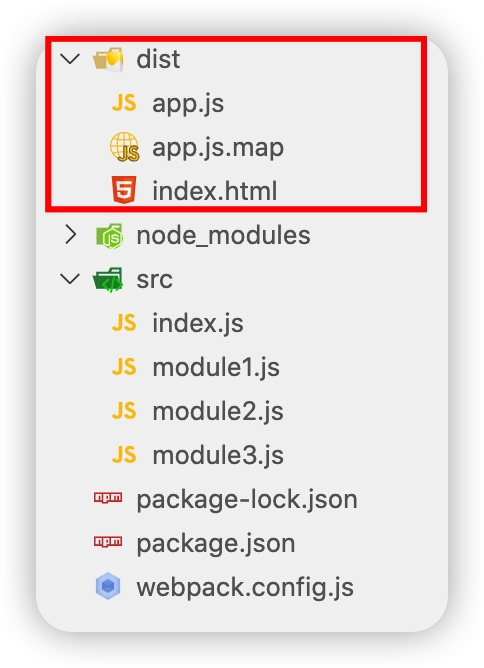

## 一、*html-webpack-plugin*

在前端迅速发展的今天，许多没有太多技术含量并且感觉是在浪费时间的事情，就可以交给构建工具来做，例如：我们去手动创建 `index.html`，手动引入打包好的 *js* 文件等操作，都可以叫 `webpack`来做，来帮助我们提升效率。

因此，你只需要理解，插件其实就是 `webpack` 的一些扩展功能，旨在帮助我们提示效率的工具。

首先，我们在我们的项目中安装 `html-webpack-plugin` 插件，命令如下：
```sh
npm i -D html-webpack-plugin
```

接下来在 `webpack.config.js`中引入 `html-webpack-plugin`插件，并添加 *plugins* 配置，如下：

引入 `html-webpack-plugin` 插件：
```js
const HtmlWebpackPlugin = require("html-webpack-plugin");
```

添加 plugins 配置信息：
```js
plugins: [
    //添加插件
    new HtmlWebpackPlugin()
]
```

接下来我们删除之前打包好的 *dist* 目录，重新运行`npm run dev`，运行结果如下：




如果是要为已有的 *html* 文件引入打包好的 *js* 文件，可以进行如下的设置：

```js
plugins: [
    // 添加插件
    new HtmlWebpackPlugin(
        // 在这个插件内部，可以指定模版和自定义生成的文件名
        {
            filename: 'main.html', // 生成的 html 文件的名称
            template: 'src/index.html' // 模板文件存在的位置
        }
    )
]
```

## *二、clean-webpack-plugin*

当我们的 `src`目录下的原文件发生了更改，这个时候就需要重新打包。但是在重新打包之前，需要先把之前打好的包给删除掉（即 *dist* 目录），每次手动删除非常的麻烦，所以此时可以使用 `clean-webpack-plugin`插件。

首先，还是需要安装此插件：
```sh
npm install -D clean-webpack-plugin 
```

接下来在 *webpack.config.js* 文件中引入此插件，并添加到 *plugins* 所对应的数组里面，如下：

```js
// 引入clean-webpack-plugin插件
const {CleanWebpackPlugin} = require("clean-webpack-plugin")


plugins: [
    //....其他插件
    new CleanWebpackPlugin()
]
```

配置之后，每次我们运行`npm run dev`，就会将之前的 dist 目录删除掉，然后重新生成新的 dist 目录。

>注：使用 *clean-webpack-plugin* 这个插件时，必须首字母大写，否则会报错。
