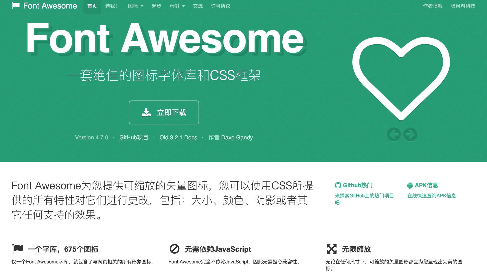

## 一、图片

在这一点上，webpack4与webpack5的版本会有很大区别，webpack5新增了一种**资源模块(asset module)**

[资源模块](https://webpack.docschina.org/guides/asset-modules/)

资源模块(asset module)是一种模块类型，它允许使用资源文件（字体，图标等）而无需配置额外 loader。

在 webpack 5 之前，通常使用：

* [raw-loader](https://v4.webpack.js.org/loaders/raw-loader/) 将文件导入为字符串
* [url-loader](https://v4.webpack.js.org/loaders/url-loader/) 将文件作为 data URI 内联到 bundle 中
* [file-loader](https://v4.webpack.js.org/loaders/file-loader/) 将文件发送到输出目录

**当然上面这几个loader你都需要npm去单独下载**

资源模块类型(asset module type)，通过添加 4 种新的模块类型(`type`)，来替换所有这些 loader：

* `asset/resource` 发送一个单独的文件并导出 URL。之前通过使用 file-loader 实现。
* `asset/inline` 导出一个资源的 data URI。之前通过使用 url-loader 实现。
* `asset/source` 导出资源的源代码。之前通过使用 raw-loader 实现。
* `asset` 在导出一个 data URI 和发送一个单独的文件之间自动选择。之前通过使用 url-loader，并且配置资源体积限制实现。

当在 webpack 5 中使用旧的 assets loader（如 `file-loader`/`url-loader`/`raw-loader` 等）和 asset 模块时，你可能想停止当前 asset 模块的处理，并再次启动处理，这可能会导致 asset 重复，你可以通过将 asset 模块的类型设置为 `'javascript/auto'` 来解决。

**webpack.config.js**
```js
//...
module: {
    rules: [
      {
        test: /\.css$/,
        use: ["style-loader", "css-loader"],
      },
      {
        test: /\.(jpg|png|gif|bmp|webp|jpeg)$/i,
        use: [
          {
            loader: "file-loader",
            options: {
              esModule: false, //file-loader 4.X 默认为true
              name: "images/[name].[ext]",
            },
          },
        ],
        type: "javascript/auto", // webpack 5中启用file-loader
      },
    ],
},
//...
```

当然我们可以使用webpack 5直接打包图片

```js
module: {
   rules: [
     {
       test: /\.(jpg|png|gif|bmp|webp|jpeg)$/i,
       type: 'asset/resource'
     }
   ]
},
```

默认情况下，`asset/resource` 模块以 `[hash][ext][query]` 文件名发送到输出目录。

可以通过在 webpack 配置中设置 `output.assetModuleFilename` 来修改此模板字符串：

**webpack.config.js**

```js
const path = require('path');

module.exports = {
  entry: './src/index.js',
  output: {
    filename: 'index.js',
    path: path.resolve(__dirname, 'dist'),
    assetModuleFilename: 'images/[hash][ext][query]'
  },
  module: {
    rules: [
      {
        test: /\.(jpg|png|gif|bmp|webp|jpeg)$/i,
        type: 'asset/resource'
      }
    ]
  },
};
```

打包存放路径和名字，也能像下面这种写法：

```js
{
    test: /\.(jpg|png|gif|bmp|webp|jpeg)$/i,
    type: 'asset/resource',
    generator: {
        filename: 'images/[hash][ext][query]'
    }
},
```

## 二、字体

在网页应用中，我们还会经常用到其他的字体。例如 *font-awesome* 就提供了一个基于 *CSS 3* 的字库，我们可以使用到里面的各种字体图标。




首先 通过npm 安装  *font-awesome* 字体图标库：

```sh
npm install font-awesome
```
安装完字体文件库之后，首先在 *index.js* 中引入字体，然后在 *index.html* 中使用字体，如下：
**src/index.js**
```js
// 引入带有字体的css文件，用来测试webpack是否支持字体大包
import "font-awesome/css/font-awesome.css"
```

**src/index.html**
```html
<div id="app">
    <i class="fa fa-bath" aria-hidden="true"></i>
    <i class="fa fa-envelope-open" aria-hidden="true"></i>
    <i class="fa fa-microchip" aria-hidden="true"></i>
    <i class="fa fa-user-circle-o" aria-hidden="true"></i>
</div>
```

最后，我们可以再`webpack.config.js`中加入字体打包的配置

```js
module: {
    rules: [
      //....其他配置
        {
            test: /\.(woff|woff2|eot|ttf|otf)$/i,
            type: 'asset/resource',
            generator: {
                filename: 'fonts/[hash][ext][query]'
              }
        }
    ],
},
```