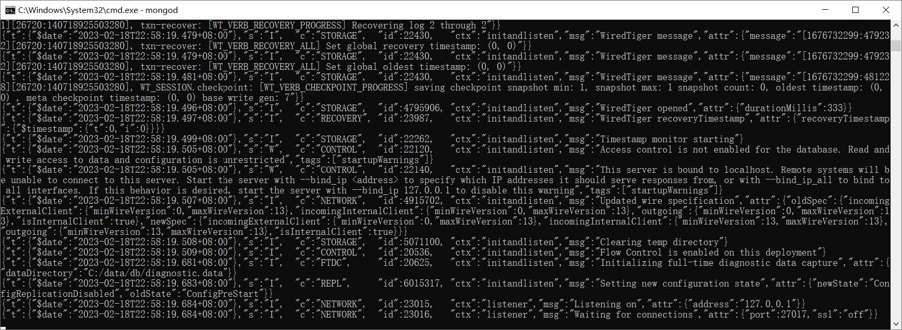
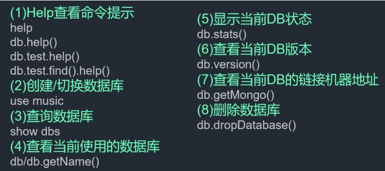
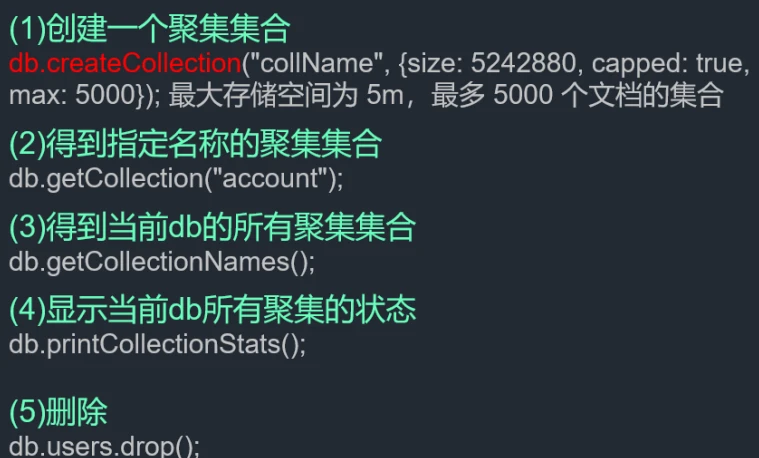
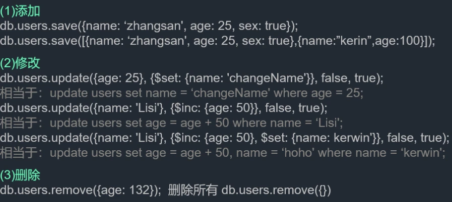
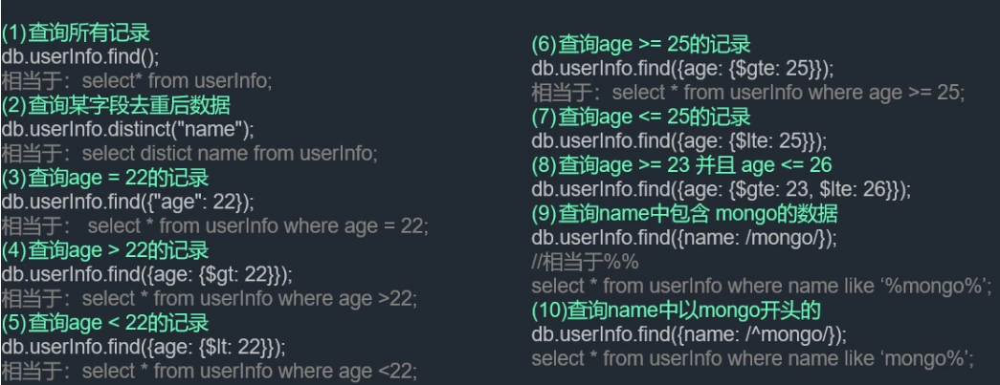
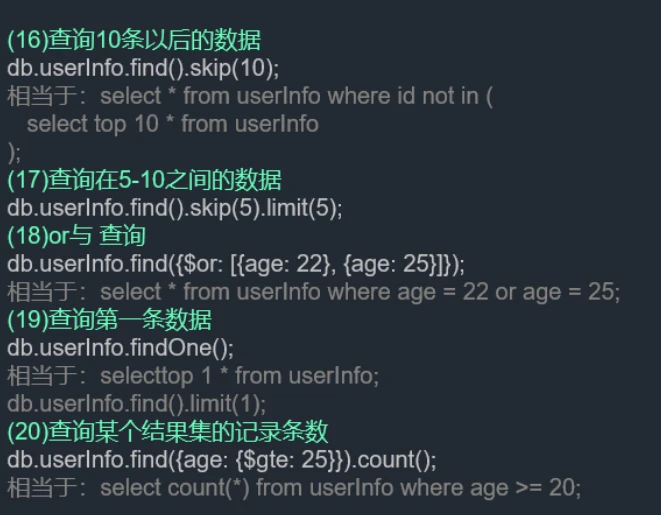

## 一、简介

### 1. Mongodb 是什么

> MongoDB 是一个基于分布式文件存储的数据库，官方地址 https://www.mongodb.com/

### 2. 数据库是什么

数据库（DataBase）是按照数据结构来组织、存储和管理数据的 `应用程序`

### 3. 数据库的作用

数据库的主要作用就是 `管理数据`，对数据进行 `增（c）、删（d）、改（u）、查（r）`

### 4. 数据库管理数据的特点

相比于纯文件管理数据，数据库管理数据有如下特点：

1. 速度更快
2. 扩展性更强
3. 安全性更强

### 5. 为什么选择 Mongodb

操作语法与 JavaScript 类似，容易上手，学习成本低

## 二、核心概念

Mongodb 中有三个重要概念需要掌握

- 数据库（database） 数据库是一个数据仓库，数据库服务下可以创建很多数据库，数据库中可以存放很多集合

- 集合（collection） 集合类似于 JS 中的数组，在集合中可以存放很多文档

- 文档（document）   文档是数据库中的最小单位，类似于 JS 中的对象


JSON 文件示例：
```json
{
	"accounts": [
  	{
		"id": "3-YLju5f3",
  		"title": "买电脑",
  		"time": "2023-02-08",
  		"type": "-1",
  		"account": "5500",
  		"remarks": "为了上网课"
  	},
  	{
  		"id": "3-YLju5f4",
  		"title": "请女朋友吃饭",
  		"time": "2023-02-08",
  		"type": "-1",
          "account": "214",
          "remarks": "情人节聚餐"
	},
	{
          "id": "mRQiD4s3K",
          "title": "发工资",
          "time": "2023-02-19",
          "type": "1",
          "account": "4396",
          "remarks": "终于发工资啦!~~"
     }
  ],
    "users":[
  	{
  		"id": 1,
  		"name": "zhangsan",
        "age": 18
  	},
  	{
  		"id": 2,
  		"name": "lisi",
  		"age": 20
  	},
  	{
  		"id": 3,
  		"name": "wangwu",
  		"age": 22
  	}
  ]
}
```

大家可以通过 JSON 文件来理解 Mongodb 中的概念

- 一个 `JSON 文件` 好比是一个 `数据库`，一个 Mongodb 服务下可以有 N 个数据库

- JSON 文件中的 `一级属性的数组值` 好比是 `集合`

- 数组中的对象好比是 `文档`

- 对象中的属性有时也称之为 `字段`


| SQL术语/概念 | MongoDB术语/概念 | 解释/说明                           |
| :----------- | :--------------- | :---------------------------------- |
| database     | database         | 数据库                              |
| table        | collection       | 数据库表/集合                       |
| row          | document         | 数据记录行/文档                     |
| column       | field            | 数据字段/域                         |
| index        | index            | 索引                                |
| table joins  |                  | 表连接,MongoDB不支持                |
| primary key  | primary key      | 主键,MongoDB自动将_id字段设置为主键 |

> 一般情况下
>
> - 一个项目使用一个数据库
> - 一个集合会存储同一种类型的数据

### 1. 下载安装与启动

下载地址： https://www.mongodb.com/try/download/community

建议选择 `zip` 类型， 通用性更强

- 使用msi类型安装时会安装MongoDB的二进制文件和默认的[配置文件](https://mongodb.net.cn/manual/reference/configuration-options/)，同时可以选择将`mongodb`添加到系统服务中实现开机自动启动。

配置步骤如下:

	1> 将压缩包移动到 `C:\Program Files` 下，然后解压
	
	2> 创建 `C:\data\db` 目录，mongodb 会将数据默认保存在这个文件夹
	
	3> 以 mongodb 中 bin 目录作为工作目录，启动命令行
	
	4> 运行命令 `mongod`



看到最后的 `waiting for connections` 则表明服务 `已经启动成功`

然后可以使用 `mongo` 命令连接本机的 mongodb 服务


> 注意：
>
> - 为了方便后续方便使用 mongod 命令，可以将 bin 目录配置到环境变量 Path 中
> - `千万不要选中服务端窗口的内容`，选中会停止服务，可以 `敲回车` 取消选中

### 2. 命令行交互

命令行交互一般是学习数据库的第一步，不过这些命令在后续用的比较少，所以大家了解即可

### 3. 数据库命令

1. 显示所有的数据库

   ```sql
   show dbs  
   show databases
   ```

2. 切换到指定的数据库，如果数据库不存在会自动创建数据库

   ```sql
   use 数据库名
   ```

3. 查看当前操作的数据库

   ```sql
   db
   ```

4. 删除当前数据库

   ```sql
   use 库名
   db.dropDatabase()
   ```

### 4. 集合命令

1. 创建集合

   ```sql
   db.createCollection('集合名称')
   ```

2. 显示当前数据库中的所有集合
   ```sql
   show collections
   ```

3. 删除某个集合

   ```sql
   db.集合名.drop()
   ```

4. 重命名集合

   ```sql
   db.集合名.renameCollection('newName')
   ```

### 5. 文档命令

1. 插入文档

   ```sql
   db.集合名.insert(文档对象);
   ```

2. 查询文档

   ```js
   db.集合名.find(查询条件)
   ```

   <span style="color:red">_id 是 mongodb 自动生成的唯一编号，用来唯一标识文档</span>

3. 更新文档

   ```sql
   db.集合名.update(查询条件,新的文档)
   db.集合名.update({name:'张三'},{$set:{age:19}})
   ```

4. 删除文档

   ```sql
   db.集合名.remove(查询条件)
   ```

### 6. 命令汇总

**数据库**



**集合**



**文档**








### 7. 应用场景

#### 新增

- 用户注册
- 发布视频
- 发布商品
- 发朋友圈
- 发评论
- 发微博
- 发弹幕
- .......

#### 删除

- 删除评论

- 删除商品

- 删除文章

- 删除视频

- 删除微博

- ......

#### 更新

- 更新个人信息
- 修改商品价格
- 修改文章内容
- ......

#### 查询

- 商品列表
- 视频列表
- 朋友圈列表
- 微博列表
- 搜索功能
- ......

## 三、Mongoose

### 1. 介绍

官网 http://www.mongoosejs.net/

- Mongoose是一个让我们可以通过Node来操作MongoDB的模块。
- Mongoose是一个对象文档模型(ODM)库,它对Node原生的MongoDB模块进行了进一步的优化封装，并提供了更多的功能。在大多数情况下，它被用来把结构化的模式应用到一个MongoDB集合，并提供了验证和类型转换等功能
- mongoose中的对象：
  - Schema 模式对象（Schema对象定义约束了数据库中的文档结构）
  - Model 模型对象（Model对象作为集合中的所有文档的表示，相当于MongoDB数据库中的集合collection）
  - Document 文档对象（Document表示集合中的具体文档，相当于集合中的一个具体的文档）

### 2. 安装

```bash
npm i mongoose
```

### 3. 使用流程

```js
 //1. 导入 mongoose
 const mongoose = require('mongoose');

 //2. 连接数据库
 //当连接的数据库不存在，插入文档时会自动创建此数据库，如果端口号是默认端口号(27017)则可以省略不写
 mongoose.connect('mongodb://127.0.0.1:27017/bilibili');
 //                                          数据库名称

 //3. 设置连接回调
 //连接成功   once 一次   事件回调函数只执行一次
mongoose.connection.once('open', () => {
	console.log('连接成功');
 	//4. 创建文档结构对象
    // 设置集合中文档的属性以及属性值的类型
 	let BookSchema = new mongoose.Schema({
 		title: String,
 		author: String,
 		price: Number
 	});
     
 	//5. 创建文档模型对象  对文档操作的封装对象  mongoose会使用集合名称的复数，创建集合
 	let BookModel = mongoose.model('book', BookSchema);
	
     //6. 插入文档
 	BookModel.create({
 		title: '西游记',
 		author: '吴承恩',
		price: 19.9
 	}, (err, data) => {
        // 判断是否有错误
 		if (err) throw err;
        //输出 data 对象  如果没有出错，则输出插入后的文档对象
 		console.log(data);
 		//7. 断开连接  关闭数据链接 (项目运行过程中，不会添加该代码)
 		mongoose.disconnect();
 	});
});

//连接出错
mongoose.connection.once('error', () => {
	console.log('连接出错~~');
})

//连接关闭
mongoose.connection.once('close', () => {
	console.log('连接关闭');
})
```

> MongoDB数据库，一般情况下，只需要连接一次，连接一次后，除非项目停止服务器关闭，否则连接一般不会断开

### 4. 字段类型

文档结构可选的常用字段类型列表

| 类型       | 描述                                                         |
| ---------- | ------------------------------------------------------------ |
| String     | 字符串                                                       |
| Number     | 数字                                                         |
| Boolean    | 布尔值                                                       |
| Array      | 数组，也可以使用 `[]` 来标识                                 |
| Date       | 日期                                                         |
| Buffer     | Buffer 对象                                                  |
| Mixed      | 任意类型，需要使用 `mongoose.Schema.Types.Mixed` 指定        |
| ObjectId   | 对象 ID，需要使用 `mongoose.Schema.Types.ObjectId` 指定      |
| Decimal128 | 高精度数字，需要使用 `mongoose.Schema.Types.Decimal128` 指定 |

### 5. 字段值验证

Mongoose 有一些内建验证器，可以对字段值进行验证，在定义Schema时使用。

#### 必填项

```js
title: {
	type: String,
 	required: true // 设置必填项
},
```

#### 默认值

```js
author: {
 	type: String,
 	default: '匿名' //默认值
},
```

#### 枚举值

```js
gender: {
	type: String,
	enum: ['男','女'] //设置的值必须是数组中的
},
```

#### 唯一值

```js
username: {
	type: String,
 	unique: true
},
```
#### 自定义匹配

```js
name:{
    type:String,
    validate:nameLength
},
function nameLength(){}
```
- validate实际上是一个函数，函数的参数代表当前字段，返回true表示通过验证，返回false表示未通过验证

> unique 需要 `重建集合` 才能有效果
>
> 永远不要相信用户的输入

### 6. CURD

数据库的基本操作包括四个，增加（create），删除（delete），修改（update），查（read）

#### 增加

插入一条

```js
SongModel.create({
	title:'给我一首歌的时间',
 	author: 'Jay'
}, function(err, data){
	//错误
	console.log(err);
	//插入后的数据对象
	console.log(data);
});
```

批量插入

```js
//1.引入mongoose
const mongoose = require('mongoose');

//2.连接mongodb数据库
mongoose.connect('mongodb://127.0.0.1:27017/project');

//3.设置连接的回调
mongoose.connection.on('open',()=>{
	//4.声明文档结构
	const PhoneSchema = new mongoose.Schema({
		brand:String,
		color:String,
		price:Number,
 		tags:Array
	})
 	//6.创建模型对象
 	const PhoneModel = mongoose.model('phone',PhoneSchema);
 	PhoneModel.insertMany([
 		{
 			brand:'华为',
 			color:'灰色',
 			price:2399,
 			tags:['电量大','屏幕大','信号好']
 		},
 		{
 			brand:'小米',
 			color:'白色',
 			price:2099,
 			tags:['电量大','屏幕大','信号好']
         }
	],(err,data)=>{
		if(err) throw err;
         console.log('写入成功');
         mongoose.connection.close();
	})
})
```

#### 删除

删除一条数据

```js
SongModel.deleteOne({_id:'5dd65f32be6401035cb5b1ed'}, function(err){
 	if(err) throw err;
 	console.log('删除成功');
	mongoose.connection.close();
});
```

批量删除

```js
SongModel.deleteMany({author:'Jay'}, function(err){
 	if(err) throw err;
 	console.log('删除成功');
	mongoose.connection.close();
});
```

#### 更新

更新一条数据

```js
//{author: 'JJ Lin'}, {$set:{author: '林俊杰'}}命令行中需要加$set
SongModel.updateOne({author: 'JJ Lin'}, {author: '林俊杰'}, function (err) {
	if(err) throw err;
	mongoose.connection.close();
});
```

批量更新数据

```js
SongModel.updateMany({author: 'Leehom Wang'}, {author: '王力宏'}, function (err) {
	if(err) throw err;
	mongoose.connection.close();
});
```

#### 查询

查询一条数据

```js
SongModel.findOne({author: '王力宏'}, function(err, data){
	if(err) throw err;
	console.log(data);
	mongoose.connection.close();
});
//根据 id 查询数据
SongModel.findById('5dd662b5381fc316b44ce167',function(err, data){
	if(err) throw err;
	console.log(data);
	mongoose.connection.close();
});
```

批量查询数据

```js
//不加条件查询
SongModel.find(function(err, data){
	if(err) throw err;
	console.log(data);
	mongoose.connection.close();
});
//加条件查询
SongModel.find({author: '王力宏'}, function(err, data){
	if(err) throw err;
	console.log(data);
	mongoose.connection.close();
});
```

### 7. 条件控制

#### 运算符

在 mongodb 不能 > < >= <= !== 等运算符，需要使用替代符号

- `>`使用 `$gt`
- `<` 使用 `$lt`
- `=` 使用 `$gte`
- `<=` 使用 `$lte`
- `!==` 使用 `$ne`

```js
db.students.find({id:{$gt:3}}); id号比3大的所有的记录

// 价格小于 20 的图书
BookModel.find({ price: { $lt: 20 } }, (err, data) => {
	if (err) {
		console.log('读取失败~~~')
		return
    }
    console.log(data)
})
```

#### 逻辑运算

`$or` 逻辑或的情况

```js
db.students.find({$or:[{age:18},{age:24}]});

// 曹雪芹 或者 余华的书
BookModel.find({ $or: [{ author: '曹雪芹' }, { author: '余华' }] }, (err, data)=>{
    if (err) {
      console.log('读取失败~~~')
      return
    }
    console.log(data)
})
```

`$and` 逻辑与的情况

```js
db.students.find({$and: [{age: {$lt:20}}, {age: {$gt: 15}}]});

// 价格大于 30 且 小于 70
BookModel.find({ $and: [{ price: { $gt: 30 } }, { price: { $lt: 70 } }] }, (err, data) => {
    if (err) {
      console.log('读取失败~~~')
      return
    }
    console.log(data)
})
```

#### 正则匹配

条件中可以直接使用 JS 的正则语法，通过正则可以进行模糊查询

```js
db.students.find({name:/imissyou/});

正则表达式，搜索书籍名称中带有 '三' 的图书
BookModel.find({ name: /三/ }, (err, data) => {
	if (err) {
		console.log('读取失败~~~')
      	return
	}
   console.log(data)
})

BookModel.find({ name: new RegExp('三') }, (err, data) => {
 	if (err) {
      	console.log('读取失败~~~')
      	return
    }
    console.log(data)
})
```

### 8. 个性化读取

#### 字段筛选

```js
//0:不要的字段
//1:要的字段
SongModel.find().select({_id:0,title:1}).exec(function(err,data){
	if(err) throw err;
	console.log(data);
	mongoose.connection.close();
});
```

> 回调不可省略，但是可以使用exec() 简写
>
> ```js
> SongModel.find().select({_id:0,title:1}).exec()
> ```

#### 数据排序

```js
// sort 排序
// 1:升序
// -1:倒序
SongModel.find().sort({hot:1}).exec(function(err,data){
	if(err) throw err;
	console.log(data);
	mongoose.connection.close();
});
```

#### 数据截取

```js
//skip 跳过   limit 限定
SongModel.find().skip(10).limit(10).exec(function(err,data){
	if(err) throw err;
	console.log(data);
	mongoose.connection.close();
});
```

### 9. 模块化

将现有的代码进行合理的拆分

```
02_mongoose模块化
 ├── config
 │   └── config.js
 ├── db
 │   └── db.js
 ├── models
 │   ├── BookModel.js
 │   └── MovieModel.js
 ├── index.js
 └── test.js
```

其中config保存数据库连接时的相关配置。

```js
//配置文件
module.exports = {
  DBHOST: '127.0.0.1',
  DBPORT: 27017,
  DBNAME: 'bilibili',
  USER: '',
  PASSWORD: ''
}
```

db则用来保存数据库连接时的通用代码，这样我们以后只需要写成功或失败连接后的回调逻辑即可。

```js
/**
 * 
 * @param {*} success 数据库连接成功的回调
 * @param {*} error 数据库连接失败的回调
 */
module.exports = function (success, error) {
  //判断 error 为其设置默认值
  if(typeof error !== 'function'){
    error = () => {
      console.log('连接失败~~~');
    }
  }
  //1. 安装 mongoose
  //2. 导入 mongoose
  const mongoose = require('mongoose');
  //导入 配置文件
  const {DBHOST, DBPORT, DBNAME} = require('../config/config.js');

  //设置 strictQuery 为 true
  mongoose.set('strictQuery', true);

  //3. 连接 mongodb 服务                        数据库的名称
  mongoose.connect(`mongodb://${DBHOST}:${DBPORT}/${DBNAME}`);

  //4. 设置回调
  // 设置连接成功的回调
  mongoose.connection.once('open', () => {
    success();
  });

  // 设置连接错误的回调
  mongoose.connection.on('error', () => {
    error();
  });

  //设置连接关闭的回调
  mongoose.connection.on('close', () => {
    console.log('连接关闭');
  });
}
```

models中用来保存集合的Schema配置

```js
const mongoose = require('mongoose');

//设置集合中文档的属性以及属性值的类型
let BookSchema = new mongoose.Schema({
  name: String,
  author: String,
  price: Number
});

//创建模型对象  对文档操作的封装对象
let BookModel = mongoose.model('books', BookSchema);

//暴露模型对象
module.exports = BookModel;

```

index.js（主要书写）

```js
//导入 mongoose
const mongoose = require('mongoose');
//导入 db 文件
const db = require('./db/db');
//导入 BookModel
const BookModel = require('./models/BookModel');

// 调用函数
db(() => {
  //7. 新增
  BookModel.create({
    name: '西游记',
    author: '吴承恩',
    price: 19.9
  }, (err, data) => {
    //判断是否有错误
    if(err) {
      console.log(err);
      return;
    }
    //如果没有出错, 则输出插入后的文档对象
    console.log(data);
  });
}, () => {
  console.log('连接失败...');
});
```

## 四、图形化管理工具

我们可以使用图形化的管理工具来对 Mongodb 进行交互，这里列出两个图形化工具

- Robo 3T 免费 https://github.com/Studio3T/robomongo/releases

- Navicat 收费 https://www.navicat.com.cn/

  


  