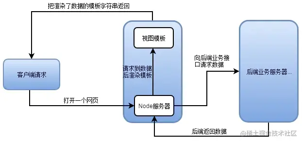
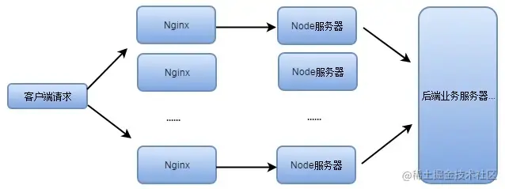

## 一、页面死循环卡死时如何上报错误 

### 1. 设置最大执行时间限制

在死循环代码周围设置一个定时器，如果循环超过设定的时间仍未完成，可以抛出一个自定义的异常，然后在try-catch块中捕获该异常。

```js
let counter = 0;
const maxExecutionTime = 1000; // 设置最大执行时间为1秒

try {
  const timer = setTimeout(() => {
    clearTimeout(timer);
    throw new Error('Execution time exceeded');
  }, maxExecutionTime);

// 页面的js逻辑

  clearTimeout(timer);
} catch (error) {
  // 处理异常
  console.error(error);
}
```

### 2. 心跳检测

在死循环代码中插入一个定时器，定时发送请求作为心跳检测，如果超过预定时间没有收到响应，就判断页面卡死，并进行错误上报。

```js
// 定时发送请求作为心跳检测
setInterval(function() {
  // 发送一个请求，如Ajax请求或者通过图片请求来模拟心跳
  // 如果超过预定时间没有收到响应，即可判断页面卡死
}, timeout);
```

## 二、中间层方案

#### 1.1 Node作为中间层模式

以Node作为中间层，当客户端打开一个网站时，先请求到node服务器这一层，通过node服务器转发请求到后端的服务器，获取数据，然后返给node的模板引擎，根据视图模板渲染好模板字符串页面，再返回给客户端，直接展示页面，如图：



在前后端分离的天然选择下，node中间层可以承担更多的责任。

- 代理：在开发环境下，我们可以利用代理来，解决最常见的跨域问题；在线上环境下，我们可以利用代理，转发请求到多个服务端。
- 缓存：缓存其实是更靠近前端的需求，用户的动作触发数据的更新，node中间层可以直接处理一部分缓存需求。
- 限流：node中间层，可以针对接口或者路由做响应的限流。
- 日志：相比其他服务端语言，node中间层的日志记录，能更方便快捷的定位问题（是在浏览器端还是服务端）。
- 监控：擅长高并发的请求处理，做监控也是合适的选项。
- 鉴权：有一个中间层去鉴权，也是一种单一职责的实现。
- 路由：前端更需要掌握页面路由的权限和逻辑。
- 服务端渲染：node中间层的解决方案更灵活，比如SSR、模板直出、利用一些JS库做预渲染等等。

#### 1.2 负载均衡器-Nginx

Nginx是一个高性能的WEB服务器和反向代理服务器，最常用的软件负载均衡器。

当访问量比较大时，频繁的请求，会给服务带来很大压力，通过负载均衡、分流，减轻服务器的压力；另一方面，网站部署在多台服务器，当某台服务器故障的时候，可以马上切换到其它服务器，还能保证网站能正常访问，这就是负载均衡的优势。




## 三、前端鉴权方案

[一文教你搞定所有前端鉴权与后端鉴权方案 - 掘金 (juejin.cn)](https://juejin.cn/post/7129298214959710244)

## 四、扫码登录方案

[微信扫码登录背后的实现原理？ - 掘金 (juejin.cn)](https://juejin.cn/post/6924218259302694919)

## 五、首屏性能提升方案

[性能优化之首屏加载🚀 - 掘金 (juejin.cn)](https://juejin.cn/post/6949896020788690958?searchId=20230811111548ACA1EEA9D9BEB39C4741#heading-14)

## 六、长列表无限滚动方案

- [useVirtualList](http://www.vueusejs.com/core/useVirtualList/)

- 使用`IntersectionObserver`