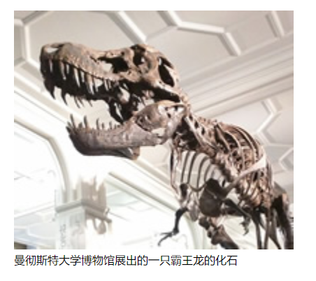

## 一、前置知识

### 1. 网页结构

- 结构-`HTML`

- 表现-`CSS`

- 行为-`JavaScript`

### 2. HTML页面的基本结构

```html
<!DOCTYPE html>
<html lang="en">
    <head>
        <meta charset="utf-8">
        <title>我的测试站点</title>
    </head>
    <body>
        <!-- 注释 -->
        <p id="page">这是我的页面</p>
    </body>
</html>
```

- `<!DOCTYPE html>`: 声明文档类型

- `<html></html>、<head></head>...`: 一对一对的尖括号，称之为标签

- `id="page"...`: 属性，用来包含元素的额外信息，这些信息不会出现在实际的内容中

- `<!-- 注释 -->`：注释

---

## 二、实体

在HTML中有些时候，我们不能直接书写一些特殊符号。比如：多个连续的空格（默认多个连续的空格会合并成一个空格），比如字母两侧的大于和小于号。如果我们需要在网页中书写这些特殊的符号，则需要使用html中的实体（转义字符）。

>  实体的语法：&实体的名字;

| 等价字符引用 | 原义字符 |
| ------------ | -------- |
| `&nbsp`      | 空格     |
| `&gt`        | 大于号   |
| `&lt`        | 小于号   |
| `&copy`      | 版权符号 |

## 三、meta元素（元数据）

用于设置网页中的一些元数据，展示给浏览器看的内容。

- charset 指定网页的字符集`<meta charset="UTF-8">`

- name 指定数据的类型、content 指定数据的内容
```html
<meta name="Keywords" content="网上购物,网上商城"/> 
<!--网页关键字，作为搜索引擎搜索时依据的关键词 -->
<meta name="description" content="京东JD.COM-专业的综合网上购物商城"/>
<!--网站的描述,作为搜索结果的相关描述，会显示在搜索引擎的搜索的结果中 -->
```
- title 网站被搜索引擎检索时的标题 `<title>Document</title>`

- 引入css文件 `<link rel="stylesheet" href="my-css-file.css">`


当然在实际使用中，你会发现许多其他类型的元数据。你在网站上看到的很多功能都是专有创作，旨在向某些网站（如社交网站）提供可使用的特定信息。

```html
<meta name="twitter:title" content="Mozilla Developer Network" />
```

## 四、 语义化标签

### 1. 块级元素

块级元素在页面中以块的形式展现 —— 相对于其前面的内容它会出现在新的一行，其后的内容也会被挤到下一行展现。块级元素通常用于展示页面上结构化的内容，例如段落、列表、导航菜单、页脚等等。

eg：`h1~h6（标题）、p（段落）`

一个块级元素不会嵌套在一个内联元素里面，但它可能嵌套在另一个块级元素里面。

> 之所以他们独占一行是因为浏览器的默认样式中将其设置为`display: block;`

### 2. 内联元素

内联元素通常出现在块级元素中并环绕文档内容的一小部分，而不是一整个段落或者一组内容。内联元素不会导致文本换行，它通常出现在一堆文字之间。

eg：`em（强调）、strong（粗体）、q(行内引用)、blockquote（块引用）、a（超链接）`


> 常用的一些语义化标签（分割线上方为H5新加的标签）

```html
<header></header>
<main></main>
<footer></footer>
<nav></nav>
<aside></aside>
<article></article>
<section></section>
------------------------------------------------
<div></div>
<span></span> 
```
### 3. 列表

- `ul>li` 无序

- `ol>li` 有序

- `dl>dt>dd` 定义列表

### 4. 超链接

超链接使我们能够将我们的文档链接到任何其他文档（或其他资源），也可以链接到文档的指定部分。

```html
<a href=".html or url" target="_blank"（新页面）>超链接</a>
<!-- href="#(顶端)、#(id)跳转到指定地方" -->          
```

- 当然我们可以将任何内容通过包裹在a标签中从而转为超链接。

我们为`iframe`标签设置`name`属性，则可以使用`target="属性值"`来将打开的链接传到`iframe`中

> URL 可以指向 HTML 文件、文本文件、图像、文本文档、视频和音频文件以及可以在网络上保存的任何其他内容。如果浏览器不知道如何显示或处理文件，它会询问你是否要打开文件（需要选择合适的本地应用来打开或处理文件）或下载文件（以后处理它）。
### 5. 缩略语 

`<abbr>`: 它常被用来包裹一个缩略语或缩写，并且提供缩写的解释（包含在[`title`](https://developer.mozilla.org/zh-CN/docs/Web/HTML/Global_attributes#title)属性中）。

```html
<p>NASA 做了一些<abbr title="chengyu">动人心弦</abbr>的事情。</p>
```


### 6. 图片标签

```html

```

- `src`: 图片路径

- `alt`：图片的描述，默认情况下不会显示，有些浏览器会在图片无法加载时显示，搜索引擎会根据alt中的内容来识别图片，如果不写alt属性则图片不会被搜索引擎所收录
- 图片的格式：jpg、gif、png、webp、base64 。效果一样，用小的；效果不一样，用效果好的。

当我们需要对图片补充一些说明性的文字时，一般会在img标签下添加一个p标签，但从语义的角度上来讲，``和`<p>` 并没有什么联系，在H5中，提供了`<figure>`和`<figcaption>`，专门用来解决这种问题。

```html
<figure>
  
  <figcaption>曼彻斯特大学博物馆展出的一只霸王龙的化石</figcaption>
</figure>
```



### 7. 内联框架

用于向当前页面中引入一个其他页面

```html
<iframe src="https://www.qq.com" width="800" height="600" frameborder="0"></iframe>
```
- `src` : 指定要引入的网页的路径
- `frameborder` : 指定内联框架的边框

### 8. 音视频

此为H5新加的标签，具体的使用可以参考[音视频](../HTML/3_h5笔记.html#十一、音视频)，以下为简单介绍。

用来向页面中引入一个外部的音频文件

**属性**：

- `controls` 是否允许用户控制播放
  
     -  `autoplay` 音频文件是否自动播放
         - 如果设置了autoplay ,则音乐在打开页面时会自动播放
         - 但是目前来讲大部分浏览器都不会自动对音乐进行播放        
     
- `loop` 音乐是否循环播放 
  
     ```html
     <audio controls>
         <!-- 对不起，您的浏览器不支持播放音频！请升级浏览器！ -->
         <source src="./source/audio.mp3">
         <source src="./source/audio.ogg">
         <!-- 老版本支持的标签 -->
         <embed src="./source/audio.mp3" type="audio/mp3" width="300" height="100">
     </audio>
     ```

### 9. 表格

在现实生活中，我们经常需要使用表格来表示一些格式化数据：课程表、人名单、成绩单....， 同样在网页中我们也需要使用表格，我们通过`table`标签来创建一个表格。

```html
<table> 
    <thead><!-- 头部 --> 
        <tr><!-- 在table中使用tr表示表格中的一行，有几个tr就有几行 -->
        	<th></th>
        </tr>
    </thead>
    <tbody><!-- 主体 --> 
        <tr>
        	<td></td><!-- 在tr中使用td表示一个单元格，有几个td就有几个单元格 -->
        </tr>
    </tbody>
    <tfoot></tfoot><!-- 底部 --> 
</table>
```

- `<td rowspan="2"></td>`:纵向合并单元格

- `<td colspan="2"></td>`:横向合并单元格

- `border-spacing`: 指定边框之间的距离（css样式）

- `border-collapse: collapse`; 设置边框的合并（css样式）

- 如果表格中没有使用tbody而是直接使用tr，那么浏览器会自动创建一个tbody，并且将tr全都放到tbody中。tr并不是table的子元素

- 默认情况下元素在td中是垂直居中的，table的单元格内元素垂直居中可以利用`vertical-align` 来设置。

- 设置垂直居中的一种方式：

  ```css
  display: table-cell;/* 将元素设置为单元格 td  */
  vertical-align: middle;
  ```


### 10. 表单

在现实生活中表单用于提交数据，同样在网页中也可以使用表单，网页中的表单用于将本地的数据提交给远程的服务器，我们使用`form`标签来创建一个表单。

```html
<form action="target.html"> <!-- action 表单要提交的服务器的地址 -->
    <input type="text" name="username">文本框 
    <input type="password" name="password">密码框 
    <input type="radio" name="hello" value="a" checked>单选按钮 
    <input type="checkbox" name="test" value="1">多选框
    <!-- 下拉列表 -->
    <select name="haha"> 
        <option value="i">选项一</option>
        <option selected value="ii">选项二</option>
    </select>
    <!-- 提交按钮 -->
    <input type="submit" value="注册">
</form>
```
- 注意：文本框和密码框必须指定name属性
- 选择框必须要指定一个value属性，value属性最终会作为用户填写的值传递给服务器
  - checked 可以将单选按钮设置为默认选中
  - 选择框必须指定name和value值才能向服务器传入数据

```html
</form>
<!-- 
   input的其他属性：
        autocomplete="off" 关闭自动补全
        readonly 将表单项设置为只读，数据会提交
        disabled 将表单项设置为禁用，数据不会提交
        autofocus 设置表单项自动获取焦点
-->
    <input type="submit">
    <input type="reset">
    <input type="button" value="按钮">
    <button type="submit">提交</button>
    <button type="reset">重置</button>
    <button type="button">按钮</button>
</form>
```

### 11. 嵌入元素

常用的嵌入元素有两种：`<object>`、`<embed>`。他们都是可替换元素，将外部内容嵌入文档中的指定位置，这个资源可能是一张图片，一个嵌入的浏览上下文，亦或是一个插件所使用的资源。

#### (1). object

```html
<object data="move.swf" type="application/x-shockwave-flash">
  <param name="foo" value="bar">
</object>
```

- 嵌入一个flash程序，`data`指的是资源内容的url，`type`为指定资源的MIME 类型。
- `param`用来为指定资源进行传参

#### (2). embed

```html
<embed type="application/x-shockwave-flash" src="movie.mov" width="640" height="480">
```

#### (3). 更加兼容的做法

```html
<object data="move.swf" type="application/x-shockwave-flash">
  <param name="foo" value="bar">
  <embed type="application/x-shockwave-flash" src="movie.mov" width="640" height="480">
</object>
```

### 12. script标签

用来加载js文件或js代码，当浏览器解析时，默认遇到script标签会暂停解析，等下载执行完毕之后再接着解析。


当然我们可以使用`<script src='xxx' async></script>`来异步加载js文件；或使用`<script src='xxx' defer></script>`延迟加载js文件。参考 [图解 script 标签中的 async 和 defer 属性](https://juejin.cn/post/6894629999215640583?searchId=20230818160034898AE4D25E63C1A72C5D)。


