## 一、HTML5和之前的一些区别

### 1. 文档类型说明

HTML5文档声明如下：

`<!DOCTYPE html>`

- 加上为标准模式，不加为怪异模式
- 其实ie9以上两种渲染模式在渲染方面基本没有明显区别

HTML4文档声明如下：

```html
<!DOCTYPE html PUBLIC "-//W3C//DTD HTML 4.01//EN"``"http://www.w3.org/TR/html4/strict.dtd">
```

- DTD: 告诉浏览器怎样规范代码

### 2. 根元素

以前的：`<html xmlns="http://www.w3.org/1999/xhtml" lang="en"></html>`

现在的：`<html></html>`

- xmlns：这是XHTML1.0的东西，它的意思是在这个页面上的元素都位于http://www.w3.org/1999/xhtml这个命名空间内,但是HTML5中的每个元素都具有这个命名空间，不需要在页面上再显示指出。

### 3. head元素

以前的：`<meta http-equiv="Content-Type" content="text/html; charset=UTF-8" />`

现在的：`<meta charset="UTF-8">`

- Content-Type：text/html表明的是这个页面的“内容类型”或者称为**MIME类型**。这个头信息将唯一确定某个资源的本质是什么，也决定了它应该如何被呈现。
- 任何资源都有自己的MIME类型，整个web都依靠MIME类型来运作
- HTML5中在资源的请求头中添加了Content-Type，不再需要自己手动标明

## 二、语义化标签

在HTML 5出来之前，我们用div来表示页面头部，章节，页脚等。但是这些div都没有实际意义。各大浏览器厂商分析了上百万的页面，从中发现了DIV名称的通用id名称大量重复。例如，很多开发人员喜欢使用`div id="footer"`来标记页脚内容，所以Html5元素引入了语义化标签（一组新的片段类元素）

```html
<hgroup></hgroup>
<!--hgroup元素代表 网页 或 section 的标题，当元素有多个层级时，该元素可以将h1到h6元素放在其内，譬如文章的主标题和副标题的组合-->
<header></header>
<!--header 元素代表 网页 或 section 的页眉。通常包含h1-h6元素或hgroup-->
<nav></nav>
<!-- nav元素代表页面的导航链接区域。用于定义页面的主要导航部分 -->
<section></section>
<!-- section元素代表文档中的节或段，段可以是指一篇文章里按照主题的分段；节可以是指一个页面里的分组 -->
<footer></footer>
<!-- footer元素代表网页或section 的页脚，通常含有该节的一些基本信息，譬如：作者，相关文档链接，版权资料 -->
<article></article>
<aside></aside>
```

## 三、其他新增标签 

### 1. 状态标签

- meter:用来显示已知范围的标量值或者分数值。
  - value:当前的数值。
  - min:值域的最小边界值。如果设置了，它必须比最大值要小。如果没设置，默认为0
  - max:值域的上限边界值。如果设置了，它必须比最小值要大。如果没设置，默认为1
  - low:定义了低值区间的上限值,如果设置了，它必须比最小值属性大，并且不能超过high值和最大值。未设置或者比最小值还要小时，其值即为最小值。
  - high:定义了高值区间的下限值。如果设置了，它必须小于最大值，同时必须大于low值和最小值。如果没有设置，或者比最大值还大，其值即为最大值。
  - optimum:这个属性用来指示最优/最佳取值。

> 示例代码

```html
<meter value="60" min="20" max="100"></meter>
<meter value="80" min="20" max="100" low="40" high="60"></meter>
<meter value="30" min="20" max="100" low="40" high="60" optimum="80"></meter>
```

> 效果图


- progress:用来显示一项任务的完成进度
  - max:该属性描述了这个progress元素所表示的任务一共需要完成多少工作.
  - value：该属性用来指定该进度条已完成的工作量。如果没有value属性,则该进度条的进度为"不确定",也就是说,进度条不会显示任何进度,你无法估计当前的工作会在何时完成

### 2. 列表标签

- datalist:datalist会包含一组option元素，这些元素表示其表单控件的可选值,它的id必须要和input中的list一致

> 示例代码

```html
<input type="text" placeholder="你最喜欢的数字是？" list="nums"></input>
<datalist id="nums">
    <option value="1">1</option>
    <option value="2">2</option>
    <option value="3">3</option>
    <option value="4">4</option>
</datalist>
```

> 效果图

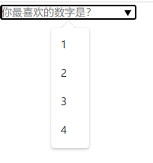

- details: 一个ui小部件，用户可以从其中检索附加信息。
  - open属性来控制附加信息的显示与隐藏
  - summary:用作 一个`<details>`元素的一个内容摘要（标题）

> 示例代码

```html
<details>
    <summary>经典台词</summary>
    <p>任何时间</p>
    <p>任何地点</p>
    <p>超级侦探，认真办案</p>
</details>
```

> 效果图

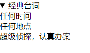

### 3. 注释标签

​	ruby
​	rt: 展示文字注音或字符注释。

### 4. 标记标签

marK:着重

## 四、canvas的基本用法

### 1. 什么是canvas(画布)

`<canvas>` 是 HTML5 新增的元素，可用于通过使用JavaScript中的脚本来绘制图形。例如，它可以用于绘制图形，创建动画。`<canvas>` 最早由Apple引入WebKit。
我们可以使用`<canvas>`标签来定义一个canvas元素

- 使用`<canvas>`标签时，建议要成对出现，不要使用闭合的形式。
- canvas元素默认具有高宽
  width：  300px
  height：150px

### 2. 替换内容

`<canvas>`很容易定义一些替代内容。由于某些较老的浏览器（尤其是IE9之前的IE浏览器）不支持HTML元素"canvas"，但在这些浏览器上你应该要给用户展示些替代内容。这非常简单：我们只需要在`<canvas>`标签中提供替换内容就可以。

- 支持`<canvas>`的浏览器将会忽略在容器中包含的内容，并且只是正常渲染canvas。
- 不支持`<canvas>`的浏览器会显示代替内容

### 3. canvas标签属性

canvas标签的两个属性`<canvas>` 看起来和 `` 元素很相像，唯一的不同就是它并没有 src 和 alt 属性。实际上，`<canvas>` 标签只有两个属性—— width和height。这些都是可选的。当没有设置宽度和高度的时候，canvas会初始化宽度为300像素和高度为150像素。

- 画布的高宽
  html属性设置width height时只影响画布本身而不影响画布内容
  css属性设置width height时不但会影响画布本身的高宽，还会使画布中的内容等比例缩放（缩放参照于画布默认的尺寸）

### 4. 渲染上下文

`<canvas>` 元素只是创造了一个固定大小的画布，要想在它上面去绘制内容，我们需要找到它的渲染上下文，`<canvas>` 元素有一个叫做 `getContext()` 的方法，这个方法是用来获得渲染上下文和它的绘画功能（**画笔**）。

- `getContext()`只有一个参数，上下文的格式

- 获取方式

  ```js
  var canvas = document.getElementById('box');
  var ctx = canvas.getContext('2d');
  ```

- 检查支持性

  ```js
  var canvas = document.getElementById('tutorial');
  if (canvas.getContext){
  	var ctx = canvas.getContext('2d');
  }
  ```

## 五、canvas绘制矩形（默认api）

HTML中的元素canvas只支持一种原生的图形绘制：**矩形**。所有其他的图形的绘制都至少需要生成一条路径

### 1. 绘制矩形

canvas提供了三种方法绘制矩形：

- 绘制一个填充的矩形（填充色默认为黑色） 
  `fillRect(x, y, width, height)`
  
  
  
- 绘制一个矩形的边框（默认边框为:一像素实心黑色）
  `strokeRect(x, y, width, height)`
  
  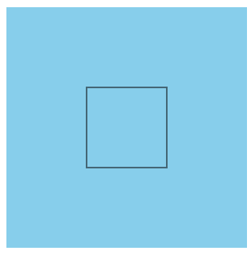
  
- 清除指定矩形区域，让清除部分完全透明。
  `clearRect(x, y, width, height)`
  
  
  
  - 在填充矩形的基础上清除中间区域
  - clearRect是在画布上绘制了一个与底色相同的边框

x与y指定了在canvas画布上所绘制的矩形的左上角（相对于原点）的坐标。
width和height设置矩形的尺寸。（存在边框的话，边框会在width上占据一个边框的宽度，height同理）

### 2. strokeRect时，边框像素渲染问题

按理渲染出的边框应该是1px的，canvas在渲染矩形边框时，边框宽度是平均分在偏移位置的两侧。
`context.strokeRect(10,10,50,50)`

- 边框会渲染在10.5 和 9.5之间,浏览器是不会让一个像素只用自己的一半的,相当于边框会渲染在9到11之间

`context.strokeRect(10.5,10.5,50,50)`

- 边框会渲染在10到11之间

### 3. 添加样式和颜色

- `fillStyle`:设置图形的填充颜色。

- `strokeStyle` :设置图形轮廓的颜色。
  默认情况下，线条和填充颜色都是黑色（CSS 颜色值 #000000）

- `lineWidth` : 这个属性设置当前绘线的粗细。属性值必须为正数。
  描述线段宽度的数字。 0、 负数、 Infinity 和 NaN 会被忽略。默认值是1.0。

- `lineWidth` & 覆盖渲染

  后绘制的矩形会覆盖之前绘制的矩形（同步思想）

- `lineJoin`
  设定线条与线条间接合处的样式（默认是 miter）
  
  - `round` : 圆角
  - `bevel` : 斜角
  - `miter` : 直角
  
- `lineCap`
  
  lineCap 是 Canvas 2D API 指定如何绘制每一条线段末端的属性。
  有3个可能的值，分别是：
  
  - `butt`  :线段末端以方形结束。
  - `round` :线段末端以圆形结束（在原有线段的基础上相加）
  - `square`:线段末端以方形结束，但是增加了一个宽度和线段相同，高度是线段厚度一半的矩形区域。
  - 默认值是 butt。

## 六、canvas绘制路径

图形的基本元素是路径。路径是通过不同颜色和宽度的线段或曲线相连形成的不同形状的点的集合。

### 1. 步骤

1. 首先，你需要创建路径起始点。
2. 然后你使用画图命令去画出路径
3. 之后你把路径封闭。
4. 一旦路径生成，你就能通过描边或填充路径区域来渲染图形。

### 2. 路径流程的api

- `beginPath()`
  新建一条路径，生成之后，图形绘制命令被指向到路径上准备生成路径。

  生成路径的第一步叫做beginPath()。本质上，路径是由很多子路径构成，这些子路径都是在一个列表中，所有的子路径（线、弧形、等等）构成图形。而每次这个方法调用之后，列表清空重置，然后我们就可以重新绘制新的图形。

  - 每次调用路径api时,都会往路径容器里做登记。调用beginPath时,清空整个路径容器
  
- `moveTo(x, y)`
  将笔触移动到指定的坐标（x，y）上
  当canvas初始化或者beginPath()调用后，你通常会使用moveTo()函数设置起点

- `lineTo(x, y)`
  绘制一条从当前位置到指定（x，y）位置的直线（原理上存在的线，其实在此处并没有渲染出来）

- `closePath()`
  闭合路径之后图形绘制命令又重新指向到上下文中。
  
  - 闭合路径closePath(),不是必需的。这个方法会通过绘制一条从当前点到开始点的直线来闭合图形。
    如果图形是已经闭合了的，即当前点为开始点，该函数什么也不做
  - 当你调用fill()函数时，所有没有闭合的形状都会自动闭合，所以你不需要调用closePath()函数。
  但是调用stroke()时不会自动闭合
  
- `stroke()`
  通过线条来绘制图形轮廓。
  不会自动调用closePath()

- `fill()`
  通过填充路径的内容区域生成实心的图形。
  自动调用closePath()合并路径   
  
- `save()`
  
  save() 是 Canvas 2D API 通过将当前状态放入栈中，保存 canvas 全部状态的方法。
  
  - 保存到栈中的绘制状态有下面部分组成：
    当前的**变换矩阵**。
    当前的剪切区域。
    当前的虚线列表。
    以下属性当前的值（**样式**）： 
    - strokeStyle,fillStyle,lineWidth,lineCap,lineJoin...
  
- `restore()`

  restore() 是 Canvas 2D API 通过在绘图状态栈中弹出顶端的状态，将 canvas 恢复到最近的保存状态的方法。如果没有保存状态，此方法不做任何改变。

### 3. 样式容器和样式栈

**样式容器：**

- 每次调用样式api时,都会往样式容器里做登记

- 调用save时候,将样式容器里的状态压入样式栈

- 调用restore时候,将样式栈的栈顶状态弹出到样式样式容器里,进行覆盖

**样式栈：**

- 调用save时候,将样式容器里的状态压入样式栈

- 调用restor时候,将样式栈的栈顶状态弹出到样式样式容器里,进行覆盖

### 4. canvas编写的基本模板

```js
var canvas = document.querySelector("#test");
if(canvas.getContext){
    var ctx = canvas.getContext("2d");
    
    ctx.save();
    //关于样式的设置
    ctx.beginPath();
    //关于路径的设置
    ctx.restore();

    ctx.save();
    //关于样式的设置
    ctx.beginPath();
    //关于路径
    ctx.fill();
    ctx.restore();
}
```

- save  restore成对出现，起到了作用域的效果，将有关样式的设置局限在作用域中

### 5. 绘制矩形

`rect(x, y, width, height)`

- 绘制一个左上角坐标为（x,y），宽高为width以及height的矩形。当该方法执行的时候，moveTo()方法自动设置坐标参数（0,0）。
  也就是说，当前笔触自动重置回默认坐标。

### 6. 绘制曲线

#### canvas绘制圆形

`arc(x, y, radius, startAngle, endAngle, anticlockwise)`

- 画一个以（x,y）为圆心的以radius为半径的圆弧（圆），从startAngle开始到endAngle结束，按照anticlockwise给定的方向（默认为顺时针）来生成。

  - ture：逆时针;      false:顺时针

- x,y为绘制圆弧所在圆上的圆心坐标;
  radius为半径;
  startAngle以及endAngle参数用**弧度**定义了开始以及结束的弧度。这些都是以x轴为基准;

  - 弧度`radians=(Math.PI/180)*degrees`

  参数anticlockwise 为一个布尔值。为true时，是逆时针方向，否则顺时针方向。

#### canvas绘制弧线

`arcTo(x1, y1, x2, y2, radius)`

- 根据控制点和半径绘制圆弧路径，使用当前的描点 (前一个 moveTo 或 lineTo 等函数的止点)。根据当前描点与给定的控制点 1 连接的直线，和控制点 1 与控制点 2 连接的直线，作为使用指定半径的圆的**切线**，画出两条切线之间的弧线路径。


#### canvas绘制二次贝塞尔曲线

`quadraticCurveTo(cp1x, cp1y, x, y)`

- 绘制二次贝塞尔曲线，cp1x,cp1y为一个控制点(P1)，x,y为结束点(P2)。起始点为moveto时指定的点(P0)。

  

#### canvas绘制三次贝塞尔曲线

`bezierCurveTo(cp1x, cp1y, cp2x, cp2y, x, y)`

- 绘制三次贝塞尔曲线，cp1x,cp 1y为控制点一(P1)，cp2x,cp2y为控制点二(P2)，x,y为结束点(P3)。起始点为moveto时指定的点(P0)。

  

## 七、canvas中的变换

`translate(x, y)`
		我们先介绍 translate 方法，它用来移动 canvas的**原点**到一个不同的位置。
		translate 方法接受两个参数。x 是左右偏移量，y 是上下偏移量，

> 在canvas中translate是累加的

`rotate(angle)`
	这个方法只接受一个参数：旋转的角度(angle)，它是顺时针方向的，以**弧度**为单位的值。
	旋转的中心点始终是 canvas 的原点，如果要改变它，我们需要用到 translate 方法

> 在canvas中rotate是累加的

`scale(x, y)`
	scale 方法接受两个参数。x,y 分别是横轴和纵轴的缩放因子，它们都必须是正值。
	值比 1.0 小表示缩小，比 1.0 大则表示放大，值为 1.0 时什么效果都没有。
	缩放一般我们用它来增减图形在 canvas 中的像素数目，对形状，位图进行缩小或者放大。

> 在canvas中scale是累加的
>
> css的像素面积变大,区域内css的像素数目减少

## 八、canvas-绘制图片

### 1.  插入图片
- canvas操作图片时，必须要等图片加载完才能操作
- `drawImage(image, x, y, width, height)`
  其中 image 是 image 或者 canvas 对象，x 和 y 是其在目标 canvas 里的起始坐标。
  这个方法多了2个参数：width 和 height，这两个参数用来控制 当像canvas画入时应该缩放的大小

### 2.  设置背景
- `createPattern(image, repetition)`
  image:图像源
  repetition:
  - "repeat"
  - "repeat-x"
  - "repeat-y"
  - "no-repeat"

- 一般情况下，我们都会将`createPattern`返回的对象作为`fillstyle`的值

### 3.  渐变
#### canvas渐变（线性渐变）

`createLinearGradient(x1, y1, x2, y2)`

- 表示渐变的起点 (x1,y1) 与终点 (x2,y2)

`gradient.addColorStop(position, color)`

- gradient：createLinearGradient的返回值
- addColorStop 方法接受 2 个参数，
  - position 参数必须是一个 0.0 与 1.0 之间的数值，表示渐变中颜色所在的相对位置。
    例如，0.5 表示颜色会出现在正中间。
  - color 参数必须是一个有效的 CSS 颜色值（如 #FFF， rgba(0,0,0,1)，等等）

> 示例代码

```js
var gradient =  ctx.createLinearGradient(0, 0, 300, 300);
gradient.addColorStop(0,"red");
gradient.addColorStop(0.5,"yellow");
gradient.addColorStop(0.7,"pink");
gradient.addColorStop(1,"green");
ctx.fillStyle=gradient;
ctx.fillRect(0,0,300,300);
```

> 效果图


#### canvas渐变（径向渐变）

`createRadialGradient(x1, y1, r1, x2, y2, r2)`

- 前三个参数则定义另一个以(x1,y1) 为原点，半径为 r1 的圆，
- 后三个参数则定义另一个以 (x2,y2) 为原点，半径为 r2 的圆。

> 示例代码

```js
var gradient = ctx.createRadialGradient(150, 150, 50, 150, 150, 100)
gradient.addColorStop(0,"red");
gradient.addColorStop(0.5,"yellow");
gradient.addColorStop(0.7,"pink");
gradient.addColorStop(1,"green");
ctx.fillStyle=gradient;
ctx.fillRect(0,0,300,300);
```

> 效果图

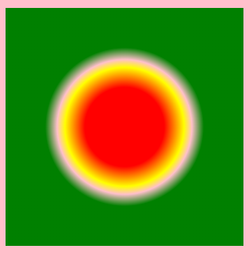

### 4. 飞鸟实例实现

> 实例代码

```js
window.onload = function () {
    const bird = document.getElementById('bird');
    bird.width = document.documentElement.clientWidth;
    bird.height = document.documentElement.clientHeight;
    if (bird.getContext) {
        const ctx = bird.getContext('2d');
        let img = new Image();
        let index = 0;
        let move = 0;
        setInterval(function(){
            ctx.clearRect(0,0,bird.width,bird.height);
            index=(++index)%9||1;
            move+=10;
            img.src= `img/q_r${index}.jpg`;
            img.onload = function(){
                ctx.drawImage(img, move, 0);
            }
        }, 100)
    }
}
```

> 效果图

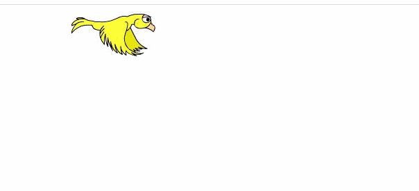

## 九、canvas-绘制文本

### 1. 在canvas中绘制文本
canvas 提供了两种方法来渲染文本

- `fillText(text, x, y)`
   - 在指定的(x,y)位置填充指定的文本
- `strokeText(text, x, y)`
  - 在指定的(x,y)位置绘制文本边框

### 2. 文本样式
`font = value`

- 当前我们用来绘制文本的样式. 这个字符串使用和 CSS font 属性相同的语法.
  默认的字体是`10px sans-serif`。
- font属性在指定时，必须要有大小和字体，缺一不可

`textAlign = value`

- 文本对齐选项. 可选的值包括： left, right  center.
  - left：文本左对齐。
  - right：文本右对齐。
  - center：文本居中对齐。

> 这里的`textAlign="center"`比较特殊。textAlign的值为center时，文本的居中是基于你在`fillText`的时候所给的x的值，也就是说文本一半在x的左边，一半在x的右边。

`textBaseline = value`

描述绘制文本时，当前文本基线的属性。

可选值：

- top：文本基线在文本块的顶部。
- middle：文本基线在文本块的中间。
- bottom：文本基线在文本块的底部。

### 3. measureText
`measureText()` 方法返回一个 TextMetrics 对象，包含关于文本尺寸的信息（例如文本的宽度）

### 4. canvas中文本水平垂直居中

```js
window.onload = function(){
    var oC =document.getElementById('c1');
    var oGC = oC.getContext('2d');
    oGC.font = '60px impact';
    oGC.textBaseline = 'middle';  //middle bottom
    var w = oGC.measureText('尚硅谷').width;
    oGC.fillText('尚硅谷',(oC.width - w)/2 , (oC.height - 60)/2);
};
```

### 5. 阴影(文本阴影&盒模型阴影)
`shadowOffsetX = float`      `shadowOffsetY = float`

- shadowOffsetX 和 shadowOffsetY 用来设定阴影在 X 和 Y 轴的**延伸距离**(偏移)，它们默认都为 0。

`shadowBlur = float`

- shadowBlur 用于设定阴影的模糊程度，其数值并不跟像素数量挂钩，也不受变换矩阵的影响，默认为 0。

`shadowColor = color(必需项)`

- shadowColor 是标准的 CSS 颜色值，用于设定阴影颜色效果，默认是全透明的黑色。

## 十、canvas-像素操作

### 1. canvas中的像素操作
到目前为止，我们尚未深入了解Canvas画布真实像素的原理，事实上，你可以直接通过ImageData对象操纵像素数据，直接读取或将数据数组写入该对象中。

### 2. 像素数据
`getImageData()`

- 获得一个包含画布场景像素数据的ImageData对象,它代表了画布区域的对象数据

`ctx.getImageData(sx, sy, sw, sh)`

- sx:将要被提取的图像数据矩形区域的左上角 x 坐标。
- sy:将要被提取的图像数据矩形区域的左上角 y 坐标。
- sw:将要被提取的图像数据矩形区域的宽度。
- sh:将要被提取的图像数据矩形区域的高度。

### 3. ImageData对象
ImageData对象中存储着canvas对象真实的像素数据，它包含以下几个只读属性：

- `width`:图片宽度，单位是像素
- `height`:图片高度，单位是像素
- `data`:Uint8ClampedArray类型的一维数组，包含着RGBA格式的整型数据，范围在0至255之间（包括255）（**像素矩阵**）
  - R:0 --> 255(黑色到白色)
  - G:0 --> 255(黑色到白色)
  - B:0 --> 255(黑色到白色)
  - A:0 --> 255(透明到不透明)


### 4. 写入像素数据
`putImageData()`方法去对场景进行像素数据的写入。

`putImageData(myImageData, dx, dy)`

- dx和dy参数表示你希望在场景内左上角绘制的像素数据所得到的设备坐标

### 5. 创建ImageData对象
`ctx.createImageData(width, height);`

- width : ImageData 新对象的宽度。
- height: ImageData 新对象的高度。

> 默认创建出来的是透明的

###  6. 马赛克案例

> 示例代码

```js
if (picture.getContext) {
    const ctx = picture.getContext('2d')
    const img = new Image()
    img.src = './img/1.jpg'
    img.onload = () => {
        picture.width = img.width;
        picture.height = img.height / 2;
        draw();
    }

    function draw() {
        ctx.drawImage(img, 0, 0, img.width / 2, img.height / 2);
        let oldImgData = ctx.getImageData(0, 0, img.width, img.height)
        let newImgData = ctx.createImageData(img.width, img.height);

        //马赛克
        mosaic(oldImgData, newImgData, 5);
        ctx.putImageData(newImgData, img.width / 2, 0);
    }

    function mosaic(oldImgData, newImgData, size) {
        for (let i = 0; i < oldImgData.width / size; i++) {
            for (let j = 0; j < oldImgData.height / size; j++) {
                //获取马赛克块中任意一点的像素信息
                let color = getPxInfo(oldImgData, i * size + Math.floor(Math.random() * size), j * size + Math.floor(Math.random() * size));
                //将整个马赛克块中所有的像素块设置为之前获取的信息
                for (let m = 0; m < size; m++) {
                    for (let n = 0; n < size; n++) {
                        setPxInfo(newImgData, i * size + m, j * size + n,color);
                    }
                }
            }

        }
    }

    //单像素操作
    function getPxInfo(imgdata, x, y) {
        let color = [];
        let data = imgdata.data;
        let w = imgdata.width;
        let h = imgdata.height;

        color[0] = data[(y * w + x) * 4];
        color[1] = data[(y * w + x) * 4 + 1];
        color[2] = data[(y * w + x) * 4 + 2];
        color[3] = data[(y * w + x) * 4 + 3];
        return color;
    }
    function setPxInfo(imgdata, x, y, color) {
        let data = imgdata.data;
        let w = imgdata.width;
        let h = imgdata.height;
        data[(y * w + x) * 4] = color[0];
        data[(y * w + x) * 4 + 1] = color[1];
        data[(y * w + x) * 4 + 2] = color[2];
        data[(y * w + x) * 4 + 3] = color[3];
    }

}


```

> 效果图


## 十一、canvas-其他api

### 1. 全局透明度的设置
`globalAlpha = value`

- 这个属性影响到 canvas 里所有图形的透明度，有效的值范围是 0.0 （完全透明）到 1.0（完全不透明），默认是 1.0。

### 2. 覆盖合成
source：新的图像(源) --- destination：已经绘制过的图形(目标)

`globalCompositeOperation：选项`

- `source-over`(默认值):源在上面（新的图像层级比较高）

- `source-in`  :只留下源与目标的重叠部分(源（新图像）的那一部分)

  > 此条指令需要加在发生重叠的两幅图像之间。

- `source-out` :只留下源超过目标的部分

- `source-atop`:砍掉源溢出的部分

> 以下部分同上

- `destination-over`:目标在上面,旧的图像层级比较高

- `destination-in`:只留下源与目标的重叠部分(目标的那一部分)

- `destination-out`:只留下目标超过源的部分

- `destination-atop`:砍掉目标溢出的部分

### 3. 将画布导出为图像
​	`toDataURL`(注意是canvas元素接口上的方法)

- 输出一个Data URI

### 4. 事件操作
`ctx.isPointInPath(x, y)`

- 判断在**当前路径**（没有被beginPath中）中是否包含检测点
  - x:检测点的X坐标；y:检测点的Y坐标

>  注意，此方法只作用于最新画出的canvas图像


## 十二、多媒体音视频

在 HTML 5 之前，要在浏览器中显示音频和视频是非常困难的，经常我们需要使用类似于 Flash 这一类的插件才能够实现。不过，从 HTML 5 开始引入了`<audio>`和`video`这 2 个标签可以实现在网页中快速插入音频和视频，同时我们还可以使用 JavaScript 来控制多媒体的播放。 

### 1. html5标签

`<video>`:Html5提供的播放视频的标签

- `src`:资源地址

- `controls`:该属性定义是显示还是隐藏用户控制界面

`<audio>`:Html5提供的播放音频的标签

- `src`:资源地址

- `controls`:该属性定义是显示还是隐藏用户控制界面

`<source>`

- 视频：

  ```html
  <video controls>
      <source src="rabbit320.mp4" type="video/mp4">
      <source src="rabbit320.webm" type="video/webm">
      <p>你的浏览器不支持 HTML5 视频。可点击<a href="rabbit320.mp4">此链接</a>观看</p>
  </video>
  ```

- 音频：

  ```html
  <audio controls>
      <source src="viper.mp3" type="audio/mp3">
      <source src="viper.ogg" type="audio/ogg">
      <p>你的浏览器不支持 HTML5 音频，可点击<a href="viper.mp3">此链接</a>收听。</p>
  </audio>
  ```

> 因为不同的浏览器和设备并不全支持相同的codecs（专利费问题），所以我们使用几个不同格式的文件来兼容不同的浏览器。如果使用的格式都得不到浏览器的支持，那么媒体文件将不会播放。

### 2. video标签的属性
- `width`  :视频显示区域的宽度，单位是CSS像素

- `height` :视频展示区域的高度，单位是CSS像素

- `poster` :一个海报帧的URL，用于在用户播放或者跳帧之前展示（视频封面）

- `src` :要嵌到页面的视频的URL

- `controls`:  显示或隐藏用户控制界面

- `autoplay`:  媒体是否自动播放

- `loop`:  媒体是否循环播放

- `muted`:  是否静音

- `preload`:  该属性旨在告诉浏览器作者认为达到最佳的用户体验的方式是什么
- `none`: 提示作者认为用户不需要查看该视频，服务器也想要最小化访问流量；换句话说就是提示浏览器该视频不需要缓存。
  
- `metadata`: 提示尽管作者认为用户不需要查看该视频，不过抓取元数据（比如：长度）还是很合理的。
  
- `auto`: 用户需要这个视频优先加载；换句话说就是提示：如果需要的话，可以下载整个视频，即使用户并不一定会用它。
  
- 空字符串：也就代指 auto 值。

### 3. audio标签的属性

`<audio>` 标签与 `<video>` 标签的使用方式几乎完全相同，由于它没有视觉部件 — 你只需
要显示出能控制音频播放的控件。故`<audio>`标签不支持`width/height`、`poster`属性，除此之外，`<audio>` 标签支持所有 `<video>` 标签拥有的特性。

包括：`src、controls、autoplay、loop、muted、preload`

### 4. 音视频的js相关属性

**可读写属性**

- `currentTime` :  开始播放到现在所用的时间(可读写)

- `muted`       :  是否静音(可读写,相比于volume优先级要高)

- `volume`      :  0.0-1.0的音量相对值(可读写)

- `playbackRate`: 设置快进或者快退速度的数字值。值为1时表示以正常速度播放。


> muted和volume之间不会同步，且muted的优先级比较高

**只读属性**

- `duration`    :  媒体总时间(只读)
- `paused`      :  媒体是否暂停(只读)

- `ended`       :  媒体是否播放完毕(只读)

- `error`       :  媒体发生错误的时候，返回错误代码 (只读)

- `currentSrc`  :  以字符串的形式返回媒体地址(只读)

> 视频多的部分：
> - `poster`  :   视频播放前的预览图片(读写)
>
> - `width、height`  :   设置视频的尺寸(读写)
>
> - `videoWidth、 videoHeight`  :   视频的实际分辨率(只读)

### 5. 音视频js相关函数
- `play()`  :  媒体播放

- `pause()`  :  媒体暂停

- `load()`  :  重新加载媒体
  - 通过js操作source更换音视频时，必须进行load重新加载媒体才能生效


### 6. js相关事件
| 事件名            | 事件描述                                                     |
| ----------------- | ------------------------------------------------------------ |
| abort |  在播放被终止时触发,例如, 当播放中的视频重新开始播放时会触发这个事件。 |
| canplay | 在媒体数据已经有足够的数据（至少播放数帧）可供播放时触发。这个事件对应CAN_PLAY的readyState。 |
| canplaythrough | 在媒体的readyState变为CAN_PLAY_THROUGH时触发，表明媒体可以在保持当前的下载速度的情况下不被中断地播放完毕。注意：手动设置currentTime会使得firefox触发一次canplaythrough事件，其他浏览器或许不会如此。 |
| durationchange | 元信息已载入或已改变，表明媒体的长度发生了改变。例如，在媒体已被加载足够的长度从而得知总长度时会触发这个事件。 |
| emptied | 媒体被清空（初始化）时触发。 |
| ended | 播放结束时触发。 |
| error | 在发生错误时触发。元素的error属性会包含更多信息。参阅Error | handling获得详细信息。 |
| loadeddata | 媒体的第一帧已经加载完毕。 |
| loadedmetadata | 媒体的元数据已经加载完毕，现在所有的属性包含了它们应有的有效信息。 |
| loadstart | 在媒体开始加载时触发。 |
| mozaudioavailable | 当音频数据缓存并交给音频层处理时 |
| pause | 播放暂停时触发。 |
| play | 在媒体回放被暂停后再次开始时触发。即，在一次暂停事件后恢复媒体回放。 |
| playing | 在媒体开始播放时触发（不论是初次播放、在暂停后恢复、或是在结束后重新开始）。 |
| progress | 告知媒体相关部分的下载进度时周期性地触发。有关媒体当前已下载总计的信息可以在元素的buffered属性中获取到。 |
| ratechange | 在回放速率变化时触发。 |
| seeked | 在跳跃操作完成时触发。 |
| seeking | 在跳跃操作开始时触发。 |
| stalled | 在尝试获取媒体数据，但数据不可用时触发。 |
| suspend | 在媒体资源加载终止时触发，这可能是因为下载已完成或因为其他原因暂停。 |
| timeupdate | 元素的currentTime属性表示的时间已经改变。 |
| volumechange | 在音频音量改变时触发（既可以是volume属性改变，也可以是muted属性改变）.。 |
| waiting | 在一个待执行的操作（如回放）因等待另一个操作（如跳跃或下载）被延迟时触发 |

## 十三、表单

### 1. 表单的不变

Html5 Forms概述，在Html5中:

1. 表单仍然使用`<form>`元素作为容器,我们可以在其中设置基本的提交特性，其中form的action指向一个服务器地址（接口）

2. 当用户或开发人员提交页面时,表单仍然用于向服务端发送表单中控件的值
   - 注意表单项的name属性必须有值，服务器才能获取表单

3. 所有之前的表单控件都保持不变

4. 仍然可以使用脚本操作表单控件

### 2.  表单的变动

#### Html5之前的表单

- 标签为`input`
  - type:text:文本框
  - type:password:密码框
  - type：radio：单选按钮
    - 注意以name分组，确保单选关系，也为了后台能成功获取
    - 必须有value属性，为了后台获取后的识别（不写统一为on）
    - checked属性,选中控制
  - type:checkbox:复选框
    - 注意以name分组，确保为一组，也为了后台能成功获取
    - 必须有value属性，为了后台获取后的识别（不写统一为on）
    - checked属性,选中控制
  - type:submit:提交按钮
  - type:reset:重置按钮
  - type:button:普通按钮

- 标签为`select`:下拉框
  - name属性在select标签上
  - multiple:可选多项，
  - 子项可以通过optgroup来进行分组
    - label属性用来定义组名，子项为option标签
  - selected属性，默认选中控制，必须有value属性,为了后台获取后的识别

- 标签为`textarea`:文本域

- 标签为`button`:按钮
  - type:submit:提交按钮
  - type:reset:重置按钮
  - type:button:普通按钮

- 标签为`lable`:控制文本与表单的关系，for属性指向一个input的id

- 标签`fieldset` 标签`legend`:来为表单分组

- [attr & prop](./2_attribute和property.html#一、定义)

### 2. 新增表单控件
1. `type:email` :email地址类型
   - 当格式不符合email格式时，提交是不会成功的，会出现提示；只有当格式相符时，提交才会通过
   - 在移动端获焦的时候会切换到英文键盘

2. `type:tel` :电话类型
   - 在移动端获焦的时候会切换到数字键盘(会自动弹出数字键盘)

3. `type:url` :url类型
   - 当格式不符合url格式时，提交是不会成功的，会出现提示；只有当格式相符时，提交才会通过。

4. `type:search` :搜索类型
   - 有清空文本的按钮（×清空文本框的内容）

5. `type:range`  :  特定范围内的数值选择器
   - 属性：min、max、step

6. 其他控件

| 类型 | 解释 |
| ---- | ---- |
| type:number | 只能包含数字的输入框 |
| type:color |  颜色选择器 |
| type:datetime | 显示完整日期(移动端浏览器支持) |
| type:datetime-local | 显示完整日期，不含时区 |
| type:time | 显示时间，不含时区 |
| type:date | 显示日期 |
| type:week | 显示周 |
| type:month | 显示月 |


### 3. 新增表单属性
- `placeholder`  :  输入框提示信息
  - 适用于form,以及type为text,search,url,tel,email,password类型的input
  - 通过`::-webkit-input-placeholder`可以选中placeholder

- `autofocus`  :  指定表单获取输入焦点
- `required`  :  此项必填，不能为空
- `pattern` : 正则验证  `pattern="\d{1,5}`
  - 限定输入框的内容
- `formaction` 在submit里定义提交地址
- `list`和`datalist`  :  为输入框构造一个选择列表
  - list值为datalist标签的id

### 4. 表单验证反馈
validity对象，通过下面的valid可以查看验证是否通过，如果八种验证都通过返回true，一种验证失败返回false

`​node.addEventListener("invalid",fn1,false);`

#### 八种验证类型

**常用：**

valueMissing  	 :  输入值为空时返回true

typeMismatch 	 :  控件值与预期类型不匹配返回true

patternMismatch  :  输入值不满足pattern正则返回true

customError : 不符合自定义验证返回true

> setCustomValidity设置自定义验证

**不常用：**

tooLong  		 :  超过maxLength最大限制返回true

rangeUnderflow   :  验证的range最小值返回true

rangeOverflow    :  验证的range最大值返回true

stepMismatch     :  验证range 的当前值 是否符合min、max及step的规则返回true

### 5. 关闭验证

formnovalidate属性

- 返回/ 设置 元素的 [`formnovalidate`](https://developer.mozilla.org/zh-CN/docs/Web/HTML/Element/Input#attr-formnovalidate) 属性，表示在表单提交时不对其进行验证。这会重写父表单的 [`novalidate`](https://developer.mozilla.org/zh-CN/docs/Web/HTML/Element/form#attr-novalidate) 属性。

## 十四、HTML 5 拖放

HTML 5 中提供了专门用于拖放的 API。拖放是网页中比较常见的功能之一，所谓拖放，即抓取对象以后拖到另一个位置。在 HTML 5 中，拖放是标准的一部分，任何元素都能够拖放。

实际上，拖放这个词我们可以拆开来看，对应两个词。分别是拖拽和释放。拖拽对应英语单词 Drag，而释放对应英语单词 Drop。这是拖放这个行为发生时的两种状态。当鼠标点击源对象后一直移动对象不松手即为拖拽，一旦松手即为释放了。

### 1. 源对象和目标对象

在讲解 HTML 5 的拖放之前，有一个概念我们必须要弄清楚，那就是什么源对象和目标对象。

**源对象**：指的是我们鼠标点击的一个事物，这里可以是一张图片，一个 div，或者一段文本等等。
**目标对象**：指的是我们拖动源对象后移动到一块区域，源对象可以进入这个区域，可以在这个区域上方悬停（未松手），可以松手释放将源对象放置此处（已松手），也可以悬停后离开该区域。

如下图所示：

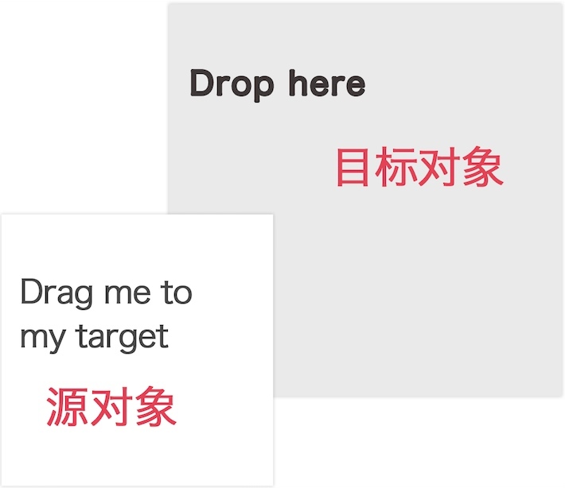
（源对象与目标对象示意图)

### 2. 拖放相关 API

除了源对象和目标对象以外，在拖动的过程中还可以抽象出一个过程对象。

因为拖放的整个事件是由不同元素产生的，一个元素被拖放，它可能会经过很多个元素，最终才到达想要放置的元素内。所以，除了被拖放的元素称为源对象，到达的元素称为目标对象以外，还可以将被经过的元素称为过程对象。

不同的对象可以触发不同的拖放事件。

源对象：

```js
dragstart：源对象开始拖放。
drag：源对象拖放过程中。（鼠标可能在移动也可能未移动）
dragend：源对象拖放结束。
```

过程对象：

```js
dragenter：源对象开始进入过程对象范围内。
dragover：源对象在过程对象范围内移动。
dragleave：源对象离开过程对象的范围。
```

目标对象：

```js
drop：源对象被拖放到目标对象内。
```

下面，我们来看一个 HTML 5 拖动的具体示例：

```html
<head>
    <meta charset="UTF-8">
    <meta name="viewport" content="width=device-width, initial-scale=1.0">
    <meta http-equiv="X-UA-Compatible" content="ie=edge">
    <title>Document</title>
    <style>
        #drag {
            width: 100px;
            height: 100px;
            background-color: red;
            position: absolute;
            left: 0;
            top: 0;
        }
    </style>
</head>

<body>
    <div id="drag" draggable="true"></div>
    <script>
        drag.ondragstart = function (event) {
            // 第 1 步 阻止目标对象的默认行为
            document.ondragover = function (e) {
                e.preventDefault();
            }
            // 第 2 步 设置目标对象的 drop 事件
            document.ondrop = function (e) {
                drag.style.left = e.clientX - event.offsetX + 'px';
                drag.style.top = e.clientY - event.offsetY + 'px';
            }
        }
    </script>
</body>
```

在此示例中，div#drag 为我们的源对象，document 既为过程对象，又为目标对象。

要实现对源对象的拖动，首先需要将源对象的 draggable 属性设置为 true。

默认地，无法将数据或者元素放置到其他元素中。如果需要设置允许放置，我们必须阻止对元素的默认处理方式。这就需要通过调用 ondragover 事件的`event.preventDefault()`方法。

最后，为目标对象设置 ondrop 事件，改变源对象的 left 和 top 值即可。

>注：原目标和目标对象必须在同一个文档流，例如要么都在标准文档流，要么都不在，否则无法拖动。

效果如下：

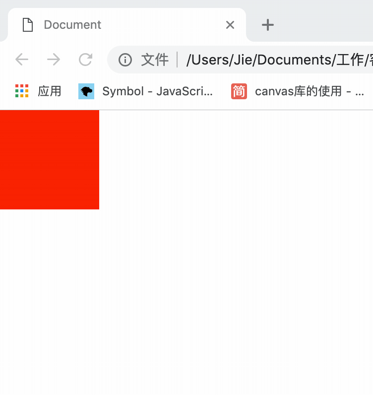

### 3. dataTransfer 对象

在所有拖放事件中，提供了一个数据传递对象 dataTransfer，用于在源对象和目标对象之间传递数据。接下来我们来看一下这个对象所包含的一些属性和方法，来看一下它是如何传递数据的。

`setData()`方法：向 dataTransfer 对象中存入数据。接收 2 个参数，第 1 个表示要存入数据种类的字符串，现在支持有以下几种：

```js
text/plain：文本文字。
text/html：HTML 文字。
text/xml：XML 文字。
text/uri-list：URL 列表，每个 URL 为一行。
```

第 2 个参数为要存入的数据。例如：

```js
event.dataTransfer.setData('text/plain','Hello World');
```

`getData()`方法：从 dataTransfer 对象中读取数据。参数为在`setData()`方法中指定的数据种类。例如：

```js
event.dataTransfer.getData('text/plain');
```

`clearData()`方法：清除 dataTransfer 对象中存放的数据。参数可选，为数据种类。若参数为空，则清空所有种类的数据。例如：

```js
event.dataTransfer.clearData();
```

`setDragImage()`方法：通过 img 元素来设置拖放图标。接收 3 个参数，第 1 个为图标元素，第 2 个为图标元素离鼠标指针的X轴位移量，第 3 个为图标元素离鼠标指针的Y轴位移量。例如：

```js
let source = document.getElementById('source'),
    icon = document.createElement('img');

icon.src = 'img.png';

source.addEventListener('dragstart',function(ev){
    ev.dataTransfer.setDragImage(icon,-10,-10)
},false)
```

**effectAllowed 和 dropEffect 属性**：这 2 个属性结合起来设置拖放的视觉效果。

>注：IE 不支持 dataTransfer 对象。

下面，我们来看一个使用了 dataTransfer 对象来进行数据传递的拖动，代码如下：

```html
<head>
    <meta charset="UTF-8">
    <title>Document</title>
    <style>
        div {
            width: 200px;
            height: 200px;
            border: 3px solid;
            float: left;
            margin-right: 20px;
        }
    </style>
</head>

<body>
    <div id="div1" ondrop="drop(event)" ondragover="allowDrop(event)">
        
    </div>
    <div id="div2" ondrop="drop(event)" ondragover="allowDrop(event)"></div>
    <script>
        let drag = function (e) {
            e.dataTransfer.setData("Text", e.target.id);
        }
        let allowDrop = function (e) {
            e.preventDefault();
        }
        let drop = function (e) {
            e.preventDefault();
            let data = e.dataTransfer.getData("Text");
            e.target.appendChild(document.getElementById(data));
        }
    </script>
</body>
```

接下来我们来具体看一下这段代码。

首先，为了使元素可拖动，需要把 draggable 属性设置为 true。本示例中 img 元素为我们的源对象，所以为 img 元素设置 draggable 属性值为 true。

接下来，在源对象上面设置 ondragstart 事件，要做的事情就是将数据存储到 dataTransfer 对象中。在 drag 的事件处理器中，我们通过`dataTransfer.setData()`方法来设置被拖数据的数据类型和值。这里我们设置的数据类型为 Text，值是可拖动元素的 id。

```js

let drag = function(e){
    e.dataTransfer.setData("Text",e.target.id);
}
```

接下来，作为容器的两个div都设置了 ondragover 事件来规定在何处放置被拖动的数据。事件的处理函数调用的`e.preventDefault()`方法来阻止元素默认的处理行为。

```js
let allowDrop = function(e){
    e.preventDefault();
}
```

最后就是 2 个容器都设置了 ondrop 事件来规定图片拖动到 div 上方并且释放后要做的事儿。对应的事件处理函数要执行的操作如下：

1. 阻止浏览器默认行为。
2. 通过`dataTransfer.getData("Text")`方法获得被拖的数据。该方法将返回在`setData()`方法中设置为相同类型的任何数据。
3. 通过 DOM 的 API 来添加相应的节点。

```js
let drop = function(e){
    e.preventDefault();
    let data=e.dataTransfer.getData("Text");
    e.target.appendChild(document.getElementById(data));
}
```

最终实现效果：可以将图片进行左右的拖动

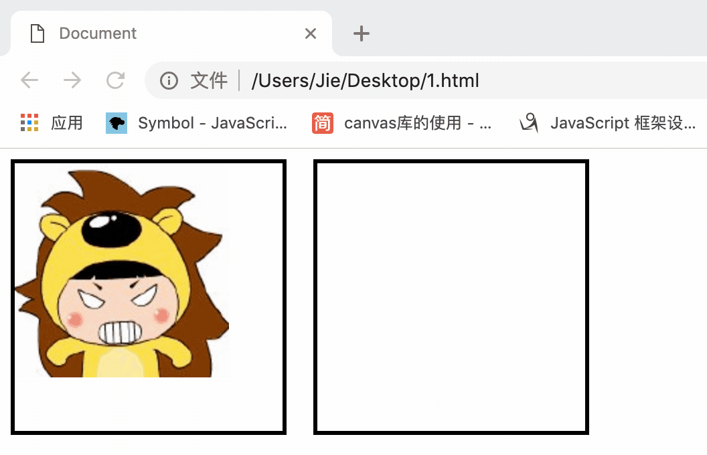

## 十五、Web Storage

Web Storage（Web 存储）提供了一种方式，可以让 Web 页面实现在客户端浏览器中意键值对的形式在本地保存数据。在了解 HTML 5 的 Web 存储之前，我们先来看一下 Cookie 存储机制的优缺点。

### 1. Cookie 存储机制的优缺点

Cookie 是 HTML 4 中在客户端存储简单用户信息的一种方式，它使用文本来存储信息，当有应用程序使用 Cookie 时，服务器端就会发送 Cookie 到客户端，客户端浏览器将会保存该 Cookie 信息。下一次页面请求时，客户端浏览器就会把 Cookie 发送到服务器。

Cookie 最典型的应用是用来保存用户信息，用户设置和密码记忆等。使用 Cookie 有其优点，也有其缺陷，其优点主要表现在以下几个方面：

- 简单易用

- 浏览器负责发送数据

- 浏览器自动管理不同站点的 Cookie。

但是经过长期的使用，Cookie 的缺点也渐渐暴露了出来，主要有以下几点：

- 因为使用的是简单的文本存储数据，所以 Cookie 的安全性很差。Cookie 保存在客户端浏览器，很容易被黑客窃取。

- Cookie 中存储的数据容量有限，其上限为 4 KB。

- 存储 Cookie 的数量有限，多数浏览器的上限为 30 或 50 个。

- 如果浏览器的安全配置为最高级别，那么 Cookie 则会失效。

- Cookie 不适合大量数据的存储，因为 Cookie 会由每个对服务器的请求来传递，从而造成 Cookie 速度缓慢效率低下。

### 2. 为什么要用 Web Storage

HTML 5 的 Web Storage 提供了 2 种在客户端存储数据的方法，`localStorage` 和 `sessionStorage`。

**`localStorage`**

localStorage 是一种没有时间限制的数据存储方式，可以将数据保存在客户端的硬盘或其他存储器，存储时间可以是一天，两天，几周或几年。浏览器的关闭并不意味着数据也会随之消失。当再次打开浏览器时，我们依然可以访问这些数据。localStorage 用于持久化的本地存储，除非主动删除数据，否则数据是永远不会过期的。

**`sessionStorage`**

sessionStorage 指的是针对一个 session 的数据存储，即将数据保存在 session 对象中。Web 中的 session 指的是用户在浏览某个网站时，从进入网站到关闭浏览器所经过的这段时间，可以称为用户和浏览器进行交互的"会话时间"。session 对象用来保存这个时间段内所有要保存的数据。当用户关闭浏览器后，这些数据会被删除。

sessionStorage 用于本地存储一个会话（session）中的数据，这些数据只有在同一个会话中的页面才能访问，并且当会话结束后数据也随之销毁。因此 sessionStorage 不是一种持久化的本地存储，仅仅是会话级别的存储。

从上面的介绍我们可以看出，**localStorage 可以永久保存数据，而 sessionStorage 只能暂时保存数据**，这是两者之间的重要区别，在具体使用时应该注意。

Web Storage 存储机制比传统的 Cookie 更加强大，弥补了 Cookie 诸多缺点，主要在以下几个方面做了加强：

- Web Storage 提供了易于使用的 API 接口，只需要设置键值对即可使用，简单方便。

- 在存储容量方面可以根据用户分配的磁盘配额进行存储，能够在每个用户域存储 5 MB～10 MB 的内容。用户不仅可以存储 session，还可以存储许多信息，如设置偏好，本地化的数据和离线数据等。

- Web Storage 还提供了使用 JavaScript 编程的接口，开发者可以使用 JavaScript 客户端脚本实现许多以前只能在服务器端才能完成的工作。

### 3. 使用 Web Storage

如果浏览器支持 Web Storage API，那么 window 对象中就会有 localStorage 和 sessionStorage 这个属性。这个属性是一个原生对象，带有很多用于存储数据的属性和方法。信息是以键值对的形式存储，值只能是字符串（非字符串类型的值会被转换为字符串类型）。

存储示例：我们可以通过`setItem()`方法来存储一个值，然后通过`getItem()`方法来获取值

在 1.html 里面设置 localStorage 的值，

1.html

```html
<body>
    <script>
        localStorage.setItem("name", "ggbond");
        console.log("信息已保存!");
    </script>
</body>
```

接下来在 2.html 里面来获取已经设置了的值。

2.html

```html
<body>
    <script>
        let name = localStorage.getItem("name");
        console.log(`姓名为 ${name}`); // 姓名为 ggbond
    </script>
</body>
```

这里，我们存储的值是存放于本地的，所以没有时间的限制，即使我们关闭浏览器，设置了的值也依然存在。

除了上面使用`getItem()`和`setItem()`方法来存取数据以外，我们还可以直接进行如下的存值和取值操作，就好像是给一个属性赋值一样，如下：

在 1.html 里面设置 localStorage 的值。

1.html

```html
<body>
    <script>
        localStorage.setItem("name", "ggbond");
        localStorage.age = 18;
        console.log("信息已保存!");
    </script>
</body>
```

接下来在 2.html 里面来获取已经设置了的值。

2.html

```html
<body>
    <script>
        let name = localStorage.getItem("name");
        let age = localStorage.age;
        console.log(`姓名为 ${name},年龄为 ${age}`); // 姓名为 ggbond,年龄为 18
    </script>
</body>
```

在 Google 浏览器中，打开控制台工具，在 Application 下的 Storage 中可以很轻松的查看到本地存储了哪些信息。如下图所示：

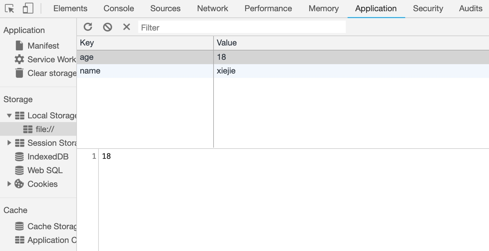

上面有提到，本地存储的值的类型只能是字符串，但是如果对应的值不是一个字符串，也会自动的被转换为字符串类型，如下：

1.html

```html
<body>
    <script>
        localStorage.stu = ['1', '2', '3'];
        console.log("信息已保存!");
    </script>
</body>
```

在 1.html 中，我们存储的是值为一个数组，接下来我们在 2.html 中将其取出来，如下：

2.html

```html
<body>
    <script>
        let stu = localStorage.stu;
        console.log(stu, typeof stu); // 1,2,3 string
    </script>
</body>
```

可以看到，即便我们存储的时候值类型不是字符串，也能够自动地被转换为字符串类型。

如果要删除本地存储中的一个条目，可以使用`removeItem()`方法或者直接使用`delete`运算符，如下：

```js
localStorage.removeItem("name");
// 或者
delete localStorage.name
```

如果要彻底删除本地存储中所有的东西，可以使用`clear()`方法，如下：

```js
localStorage.clear()
```

### 4. storage 事件

每次将一个值存储到本地存储时，就会触发一个 storage 事件。由事件监听器发送给回调函数的事件对象有几个自动填充的属性如下：

```js
key：告诉我们被修改的条目的键。
newValue：告诉我们被修改后的新值。
oldValue：告诉我们修改前的值。
storageArea：告诉我们是本地存储还是会话存储。
url：被改变键的文档地址。
```

>需要注意的是，这个事件只在同一域下的任何窗口或者标签上触发，并且只在被存储的条目改变时触发。

示例如下：这里我们需要打开服务器进行演示，本地文件无法触发 storage 事件

1.html 代码如下：在该页面下我们设置了两个 localStorage 并存储了 2 个值。

```html
<!DOCTYPE html>
<html lang="en">
<head>
    <meta charset="UTF-8">
    <title>Document</title>
</head>
<body>
    <script>
        localStorage.name = "ggbond";
        localStorage.age = 20;
        console.log("信息已经设置!");
    </script>
</body>
</html>
```

2.html 代码如下：在该页面中我们安装了一个 storage 的事件监听器，安装之后只要是同一域下面的其他 storage 值发生改变，该页面下面的 storage 事件就会被触发。

```html
<!DOCTYPE html>
<html lang="en">
<head>
    <meta charset="UTF-8">
    <title>Document</title>
</head>
<body>
    <script>
        let name = localStorage.getItem("name");
        let age = localStorage.age;
        console.log(`姓名为${name},年龄为${age}`);
        window.addEventListener("storage",(e)=>{
            console.log(`${e.key}从${e.oldValue}修改为${e.newValue}`);
            console.log(`这是一个${e.storageArea}存储`);
            console.log(`被改变的url为${e.url}`);
        },true);
    </script>
</body>
</html>
```

接下来我们来改变 1.html 里面 localStorage.name 的值。

```js
localStorage.name = "猪猪侠";
```

之后我们就会看到安装在 2.html 页面里面的 storage 事件就会被触发，显示出如下效果：


最后，需要说明一下的就是虽然 Web Storage 只能存储字符串看起来限制很大，但是通过使用 JSON，我们可以在本地存储中存储任何的 JSON 对象，如下：

```js
let xiejie = {"name":"xiejie","age":18};
localStorage.setItem("info",JSON.stringify(xiejie));
```

>JSON 对象和数组不一样，存储之前需要使用`JSON.stringify()`方法将其转换为字符串，否则存储进去的是 [object Object]。

这段代码会将 xiejie 这个对象存储为以 info 为键的一个 JSON 字符串，当我们要将其取出来使用的时候，只需要再使用`JSON.parse()`方法将其转换回 JSON 对象即可。

```js
xiejie = JSON.parse(localStorage.info);
```

## 十六、本地文件读取

HTML 5 为我们提供了一种通过 File API 规范与本地文件交互的标准方式。

为了举例说明其功能，可使用 File API 在向服务器发送图片的过程中创建图片的缩略图预览，或者允许应用程序在用户离线时保存文件引用。

另外，可以使用客户端逻辑来验证上传内容的 mimetype 与其文件扩展名是否匹配，或者限制上传内容的大小。

该规范通过"本地"文件系统提供了多种文件访问接口：

```
File：独立文件。提供只读信息，例如名称、文件大小、mimetype 和对文件句柄的引用。
FileList：File 对象的类数组序列（考虑 <input type="file" multiple> 或者从桌面拖动目录或文件）。
Blob：可将文件分割为字节范围。
```

与以上数据结构结合使用时，`FileReader` 接口可用于通过熟悉的 JavaScript 事件处理来异步读取文件。因此，可以监控读取进度、找出错误并确定加载何时完成。这些 API 与 XMLHttpRequest 的事件模型有很多相似之处。

>注：从 Firefox 3.6.3 起，就不支持`File.slice()`方法了。

### 1. 选择文件

首先需要检查浏览器是否完全支持 File API：

```html
<body>
    <script>
        // Check for the various File API support.
        if (window.File && window.FileReader && window.FileList && window.Blob) {
            alert('Great success! All the File APIs are supported.');
        } else {
            alert('The File APIs are not fully supported in this browser.');
        }
    </script>
</body>
```

当然，如果我们的应用程序只会用到这些 API 中的一小部分，请相应地修改此代码段。

**使用表单输入进行选择**

要加载文件，最直接的方法就是使用标准`<input type="file">`元素。JavaScript 会返回选定的 File 对象的列表作为 FileList。以下示例使用"multiple"属性实现了同时选择多个文件：

```html
<body>
    <input type="file" id="files" name="files[]" multiple />
    <output id="list"></output>
    <script>
        // 绑定事件
        document.getElementById('files').addEventListener('change', handleFileSelect, false);
        // 事件处理器
        function handleFileSelect(evt) {
            const files = evt.target.files; // FileList 对象
            let output = [];
            // 遍历 FileList 对象 , 获取 name , type , size , lastModifiedDate 属性
            for (let i = 0; i < files.length; i++) {
                output.push(
                    `
                    <li>name:${files[i].name}，type:${files[i].type}，size:${files[i].size}，lastModifiedDate:${files[i].lastModifiedDate.toLocaleDateString()}</li>
                `
                );
            }
            console.log(output);
            document.getElementById('list').innerHTML = `<ul>${output.join('')}</ul>`;
        }
    </script>
</body>
```

效果如下：

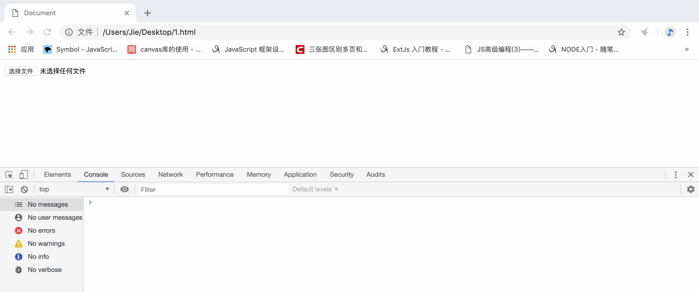

**使用拖放操作进行选择**

另一种加载文件的方法是在本地将文件从桌面拖放到浏览器。我们可以对前一个示例稍作修改，加入拖放支持。

```html
<body>
    <div id="drop_zone">Drop files here</div>
    <output id="list"></output>
    <script>
        function handleFileSelect(evt) {
            evt.stopPropagation();
            evt.preventDefault();
            let files = evt.dataTransfer.files; // FileList 对象
            let output = [];
            // 遍历 FileList 对象 , 获取 name , type , size , lastModifiedDate 属性
            for (let i = 0; i < files.length; i++) {
                output.push(
                    `
                    <li>name:${files[i].name}，type:${files[i].type}，size:${files[i].size}，lastModifiedDate:${files[i].lastModifiedDate.toLocaleDateString()}</li>
                `
                );
            }
            document.getElementById('list').innerHTML = `<ul>${output.join('')}</ul>`;
        }

        function handleDragOver(evt) {
            evt.stopPropagation();
            evt.preventDefault();
            evt.dataTransfer.dropEffect = 'copy'; // 明确表明这是一个文件的复制
        }
        const dropZone = document.getElementById('drop_zone');
        dropZone.addEventListener('dragover', handleDragOver, false);
        dropZone.addEventListener('drop', handleFileSelect, false);
    </script>
</body>
```

效果：

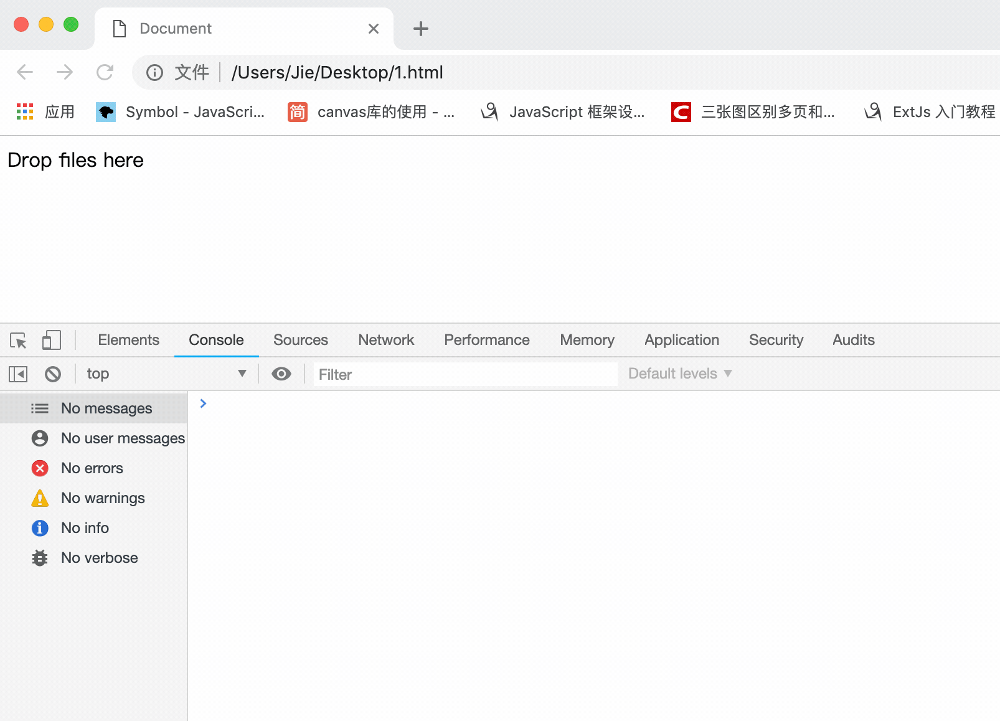

>注：有些浏览器会将`<input type="file">`元素视为本地拖放目标。

### 2. 读取文件

当获取了 File 引用后，实例化 `FileReader` 对象，以便将其内容读取到内存中。加载结束后，将触发读取程序的 onload 事件，而其 result 属性可用于访问文件数据。

`FileReader` 包括四个异步读取文件的选项：

```
FileReader.readAsBinaryString(Blob|File)：result 属性将包含二进制字符串形式的 file/blob 数据。每个字节均由一个 [0..255] 范围内的整数表示。
FileReader.readAsText(Blob|File, opt_encoding)：result 属性将包含文本字符串形式的 file/blob 数据。该字符串在默认情况下采用“UTF-8”编码。使用可选编码参数可指定其他格式。
FileReader.readAsDataURL(Blob|File)：result 属性将包含编码为数据网址的 file/blob 数据。
FileReader.readAsArrayBuffer(Blob|File)：result 属性将包含 ArrayBuffer 对象形式的 file/blob 数据。
```

对 FileReader 对象调用其中某一种读取方法后，可使用 onloadstart、onprogress、onload、onabort、onerror 和 onloadend 事件来跟踪其进度。

| 事件名称    | 描述                                    |
| ----------- | --------------------------------------- |
| onabort     | 当读取操作被中止时调用                  |
| onerror     | 当读取操作发生错误时调用                |
| onload      | 当读取操作成功完成时调用                |
| onloadend   | 当读取操作完成时调用,不管是成功还是失败 |
| onloadstart | 当读取操作将要开始之前调用              |
| onprogress  | 在读取数据过程中周期性调用              |

下面的示例从用户选择的内容中过滤掉了图片，对文件调用`reader.readAsDataURL()`，并通过将 src 属性设为数据网址来呈现缩略图。

```html
<head>
    <meta charset="UTF-8">
    <meta name="viewport" content="width=device-width, initial-scale=1.0">
    <meta http-equiv="X-UA-Compatible" content="ie=edge">
    <title>Document</title>
    <style>
        .thumb{
            width: 300px;
            border: 1px solid;
            margin: 10px 5px 0 0;
        }
    </style>
</head>

<body>
    <input type="file" id="files" name="files[]" multiple />
    <div id="list"></div>
    <script>
        function handleFileSelect(evt) {
            const files = evt.target.files; // FileList 对象
            for (let i = 0; i < files.length; i++) {
                if (!files[i].type.match('image.*')) {
                    continue;
                }
                const reader = new FileReader();
                // 通过闭包来获取文件信息
                reader.onload = (function (theFile) {
                    document.getElementById('list').innerHTML = '';
                    return function (e) {
                        const div = document.createElement('div');
                        div.innerHTML = [''
                        ].join('');
                        document.getElementById('list').appendChild(div, null);
                    };
                })(files[i]);
                // 读取图片文件作为数据 URL 
                reader.readAsDataURL(files[i]);
            }
        }
        document.getElementById('files').addEventListener('change', handleFileSelect, false);
    </script>
</body>
```

效果：

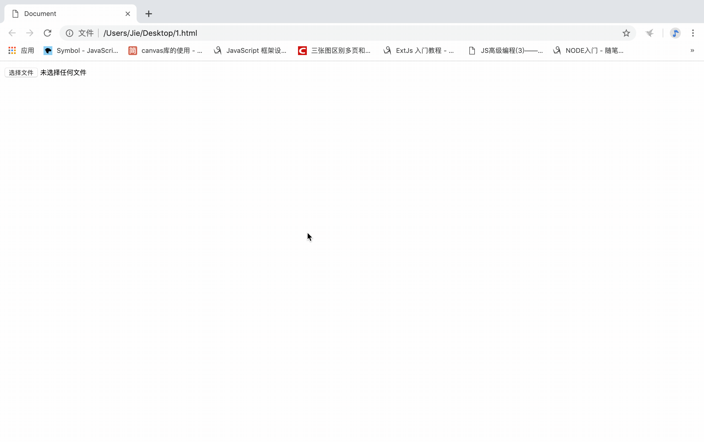

>注：本文参考自 Eric Bidelman 所发表的博文，博文原址：https://www.html5rocks.com/zh/tutorials/file/dndfiles/#toc-introduction
>
>在他的博文中，还介绍了分割文件以及监控读取进度等操作。


