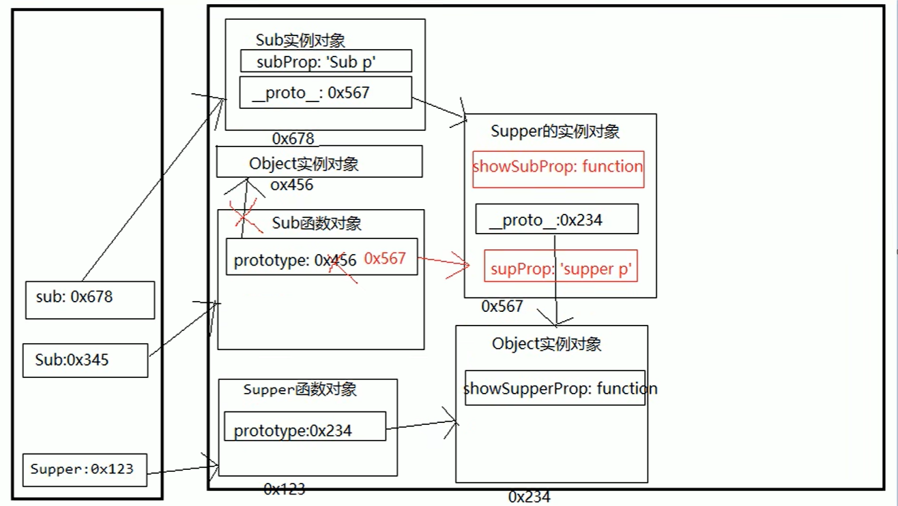

## 一、创建对象

### 1. Object构造函数模式

```js
var obj = {};
obj.name = 'Tom'
obj.setName = function(name){this.name=name}
```

适用于起始创建时对象内部数据不确定，语句较多

### 2. 对象字面量模式

```js
var obj = {
  name : 'Tom',
  setName : function(name){this.name = name}
}
```

适用于起始创建时对象内部数据确定，但是创建多个对象时重复代码较多

### 3. 工厂函数模式(不常用)

```js
function createPerson(name, age) { //返回一个对象的函数===>工厂函数
  var obj = {
   name: name,
   age: age,
   setName: function (name) {
     this.name = name
   }
  }
  return obj
 }
 // 创建2个人
 var p1 = createPerson('Tom', 12)
 
function createStudent(name, price) {
     var obj = {
         name: name,
         price: price
     }
     return obj
}
 var s = createStudent('张三', 12000)
```

- 适用场景: 需要创建多个对象
- 问题: 对象没有一个具体的类型, 都是Object类型

### 4. 自定义构造函数模式

```js
//定义类型
function Person(name, age) {
  this.name = name;
  this.age = age;
  this.setName = function(name){this.name=name;};
}
var p1 = new Person('tom', 12);
var p2 = new Person('bob', 13);
```

* 适用场景: 需要创建多个类型确定的对象
* 问题: 每个对象都有相同的数据，浪费内存(公共的方法)

### 5. 构造函数 + 原型的组合模式

```js
function Person(name, age) {
  this.name = name;
  this.age = age;
}
Person.prototype.setName = function(name){this.name=name;};
var p1 = new Person('tom', 12);
var p2 = new Person('bob', 13);
```

## 二、对象与原型的相关方法

### 1. Object的API

#### Object.is

用于判断两个数据是否相等，基本上跟严格相等（`===`）是一致的，除了以下两点：

1) NaN和NaN相等
2) +0和-0不相等

#### Object.assign

用于混合对象

```javascript
let a = {
  x: 1,
  obj: {
    aa: 11,
    bb:22,
  }
}
let b = {
  y:1
}

let oo = Object.assign({},a, b);
console.log(oo);
```

注意这里第一个参数为什么要用空对象，因为`Object.assign`会将源对象的所有属性复制到目标对象上,并且返回目标对象，如果，你像这样做的话：

```
let oo = Object.assign(a, b);
```

就会改变a对象的内容，并返回了a对象

其实在ES7中，我们有更棒的写法:

```javascript
let oo = {
    ...a,
    ...b
}
```

#### Object.getOwnPropertyNames 的枚举顺序

`Object.getOwnPropertyNames`方法之前就存在，只不过，官方没有明确要求，对属性的顺序，如何排序，完全由浏览器厂商决定。

ES6规定了该方法返回的数组的排序方式如下：

- 先排数字，并按照升序排序
- 再排其他，按照书写顺序排序

```javascript
const obj = {
  d: 1,
  b: 2,
  a: 3,
  11: 6,
  5: 2,
  4: 1
}
const props = Object.getOwnPropertyNames(obj)
console.log(props)
```

**注意：有一些面试题，可以灵活的使用该函数**

#### Object.setPrototypeOf

该函数用于设置某个**对象**的隐式原型

比如： `Object.setPrototypeOf(obj1, obj2)`，相当于：  `obj1.__proto__ = obj2`

```javascript
let o1 = {
  name: "张三",
  age:18
}
let o2 = {
  sex:"男"
}
Object.setPrototypeOf(o2, o1);
for (let k in o2) { 
  console.log(k);
}
```

#### Object.getPrototypeOf()

查找一个对象的原型对象

```javascript
let o1 = {
  name: "张三",
  age:18
}
let o2 = {
  sex:"男"
}

Object.setPrototypeOf(o2, o1);

console.log(Object.getPrototypeOf(o2));
```

#### Object.fromEntries

将键值对类型转换为Object

```javascript
let authors = [[0,"天蚕土豆"], [1,"唐三"], [2,"辰东"], [3,"火星引力"], [4,"月关"]];
let obj = Object.fromEntries(authors);
console.log(obj);

let map = new Map();
map.set("name", "斗破苍穹");
map.set("author", "天蚕土豆");
map.set("price", 100);

let obj2 = Object.fromEntries(map);
console.log(obj2);
```

#### Object.entries

返回一个给定对象自身可枚举属性的键值对数组

```javascript
let obj = {
  name: "张三",
  age: 18,
  score: 90,
}
let arr = Object.entries(obj);
console.log(arr);
```

```javascript
// 将下面对象的值翻倍
let obj = {
  x: 1,
  y: 2,
  z: 3,
}
let obj2 = Object
  .fromEntries(
    Object
      .entries(obj)
      .map(([k, v]) => [k, v * 2]));
console.log(obj2);
```

#### Object.defineProperty

给对象添加或修改一个属性

```javascript
let obj = {
  name: "张三",
  age: 18,
  score: 90,
}
Object.defineProperty(obj, "sex", {
  value: "男", // 值
  writable: true, // writable 是否可以修改该属性的值，默认 false
  configurable: true,// configurable 是否可以修改该属性的描述，，默认 false
  enumerable: true,// 该属性是否出现在对象的枚举属性中，默认 false
});
obj.sex = "女";
console.log(obj.sex);

Object.defineProperty(obj, "tel", {
  get(val) { // 获取该属性的值时调用 get 函数
    console.log("get--->" + val);
  },
  set(val) { // 设置该属性的值时调用 set 函数
    console.log("set--->" + val);
  }
});

obj.tel = "12232434";
```

#### Object.defineProperties

给对象添加或修改多个属性

```javascript
let obj = {
  name: "张三",
  age: 18,
  score: 90,
}

Object.defineProperties(obj, {
  tel: {
    value: "13800000000",
    enumerable: true
  },
  sex: {
    value: "男"
  }
});

for (let k in obj) { 
  console.log(k + "---" + obj[k]);
}

console.log(obj.sex);
```

#### keys、values、entries

```javascript
var obj = {name:'xxx',age:24}
Object.keys(obj) // 返回一个数组 ['name','age']
Object.values(obj) // 返回一个数组 ['xxx',24]
Object.entries (obj) // 返回一个二维数组 [['name','age'],['xxx',24]]
```

### 2. 原型相关属性和方法

#### prototype 和`__proto__`

prototype 是构造函数上面的一个属性，指向一个对象，这个对象是该构造函数实例化出来的对象的原型对象。实例化出来的对象可以通过`__proto__`来找到自己的原型对象。如下：

```javascript
// let arr = [1, 2, 3, 4];
let arr = new Array(1, 2, 3, 4); //和上面其实是一个意思
console.log(arr);
console.log(arr.__proto__); //Object(0) []
console.log(Array.prototype); //Object(0) []
console.log(arr.__proto__ === Array.prototype);//true
console.log(arr.__proto__.constructor === Array);//true
```

这是使用JS自带的Array构造函数，其实使用我们自己的构造函数是一样的道理

```javascript
function add() { }
let a = new add();
let b = new add();
console.log(a.__proto__ === add.prototype);
console.log(b.__proto__ === add.prototype);
console.log(a.__proto__ === b.__proto__);
```


#### constructor

通过 constructor 属性，我们可以查看到一个对象的构造函数是什么，constructor属性其实是原型对象的属性,注意观察上面的图

```
function add() { }
let a = new add();
let b = new add();

console.log(add.prototype.constructor);//[Function: add]
console.log(a.__proto__.constructor);//[Function: add]
console.log(a.constructor);//[Function: add]
console.log(a.constructor === add);//true
```

#### instanceof 操作符

判断一个对象是否是一个构造函数的实例。如果是返回 true，否则就返回 false

```js
const arr = [1,2,3,4,5];
console.log(arr instanceof Array); // true
console.log(arr instanceof Number); // false

function add() { }
let a = new add();
let b = new add();
console.log(a instanceof add); //true
console.log(a instanceof Object); //true
```

#### `isPrototypeOf()`

该方法将会返回一个布尔值，主要用于检测一个对象是否是一个实例对象的原型对象

其实就是某个对象饿隐式原型是否指向某个对象

```javascript
let obj = {
  name: "张三",
  age: 18,
}
let a = Object.create(obj);
console.log(obj.isPrototypeOf(a)); //true

const arr = [1,2,3,4];
console.log(Array.prototype.isPrototypeOf(arr)); // true
console.log(arr.__proto__.isPrototypeOf(arr)); // true
```

#### hasOwnProperty()

判断一个属性是定义在对象本身上面的，还是从原型对象上面继承而来的。如果是本身的，则返回 true，如果是继承而来的或者根本没有这个属性，则返回 false

```js
let obj = {
  name: "张三",
  age: 18,
}
let a = Object.create(obj, {
  sex: {
    value: "男",
    enumerable: true,
    writable:true
  }
});

console.log(a.hasOwnProperty("name"));
console.log(a.hasOwnProperty("name"));
console.log(a.hasOwnProperty("sex"));
console.log(a.hasOwnProperty("aaa"));
```

## 三、继承模式

### 1. 原型链继承 

* 为了得到 ==父类型的方法==
* 关键：让子类型的原型指向父类型的实例

```js
function Parent(){}
Parent.prototype.test = function(){};

function Child(){}
Child.prototype = new Parent(); // 子类型的原型指向父类型的实例
Child.prototype.constructor = Child//让子类型的原型的construcor指向子类型

var child = new Child(); //有test()
```



### 2. 借用构造函数(假) 

* 为了得到 ==父类型的属性==
* 关键：在子类型构造函数中使用`call()`调用父类型构造函数

```js
function Parent(name){
    this.name = name
}

function Child(name,price){
    Parent.call(this, name);//借用构造函数 this.Parent(xxx)
    this.price = price
}
var child = new Child('a', 20);  
```

### 3. 组合继承

> 这种继承也被称之为 ==伪经典继承== ，该继承方式综合了原型链和借用构造函数的方式，将两者的优点集中了起来。

```js {9,12}
// 父类
function Parent(name){
    this.name = name
}
Parent.prototype.setName = function(){
    this.name = name
}
// 子类
function Child(name,price){
    Parent.call(this, name); // 盗用父类的构造函数
    this.price = price
}
Child.prototype = new Parent(); //改变子类构造函数的原型对象
Child.prototype.constructor = Child // 修正
// 测试
var child = new Child('a', 20); 
child.setName('b')
```

组合继承最大的问题就是 ==效率问题== 。最主要就是父类的构造函数始终会被调用两次：一次是在指定子类原型时调用，另一次是在子类构造函数中调用。

### 4. 圣杯模式

> 圣杯模式的继承解决了这一问题，其基本思路就是不通过调用父类构造函数来给子类原型赋值，而是取得父类原型的一个副本，然后将返回的新对象赋值给子类原型。

```js
function inherit(Child,Parent){
    function F(){};
    F.prototype = Parent.prototype; // 拿到父类原型的副本
    Child.prototype = new F(); //改变子类构造函数的原型对象
    Child.prototype.constructor = Child // 修正
}
// 父类
function Parent(name){
    this.name = name
}
Parent.prototype.setName = function(){
    this.name = name
}
// 子类
function Child(name,price){
    Parent.call(this, name); // 盗用父类的构造函数
    this.price = price
}
inherit(Child, Parent); // 使用圣杯模式实现继承
// 测试
var child = new Child('a', 20); 
child.setName('b')
```

### 5. new操作符都做了哪些事

`new` 运算符创建一个用户定义的对象类型的实例或具有构造函数的内置对象的实例。

* 创建一个空的简单js对象`{}`
* 给对象设置`__proto__`, 值为构造函数对象的`prototype`属性值   `this.__proto__ = Fn.prototype`，即设置该对象的原型对象
* 将新创建的对象作为 `this` 的上下文，执行构造函数体(给对象添加属性/方法)
