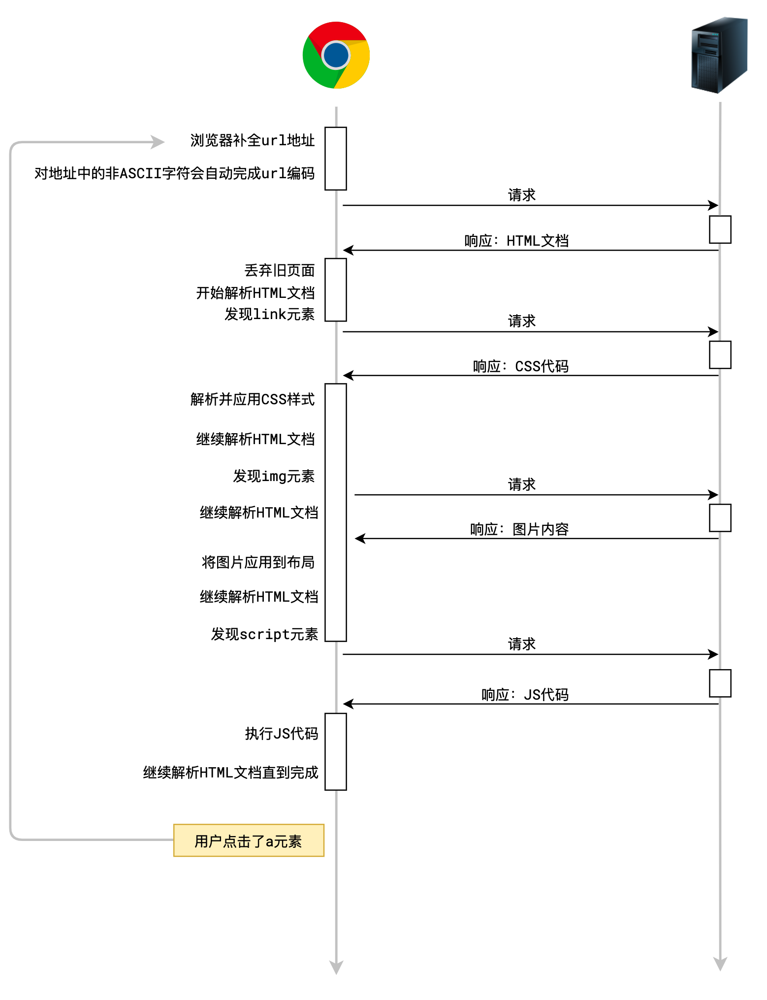
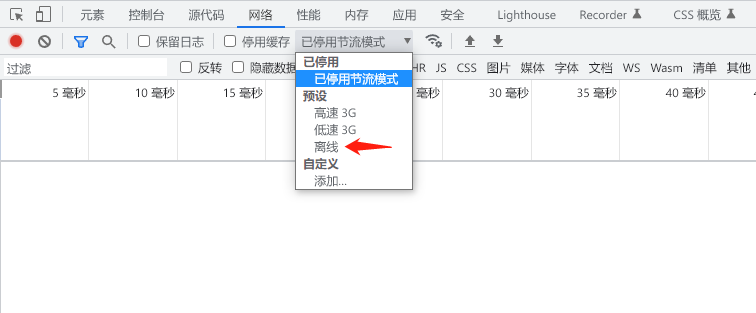
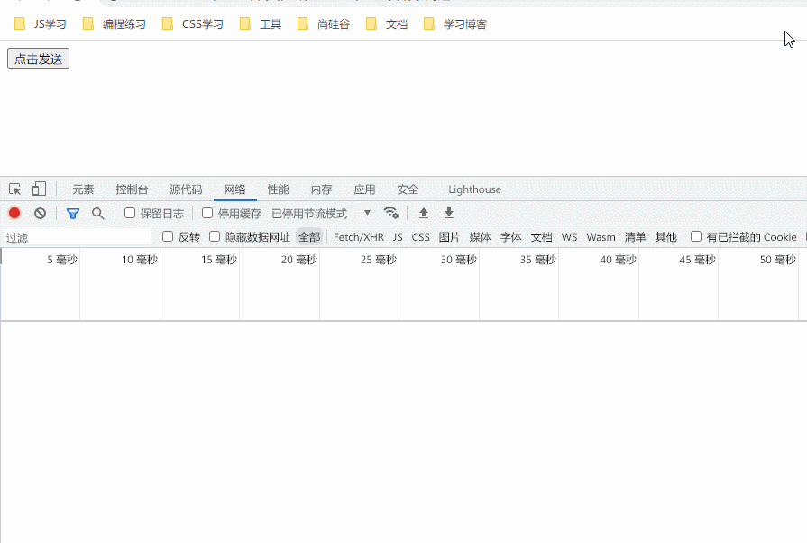
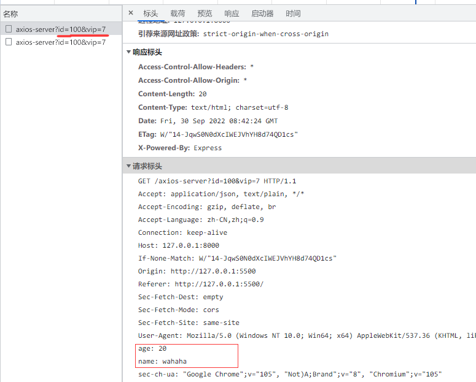
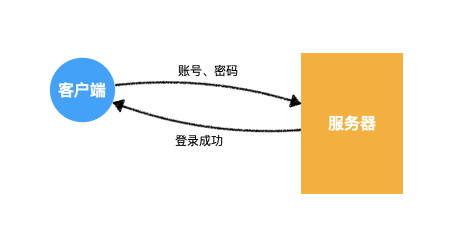
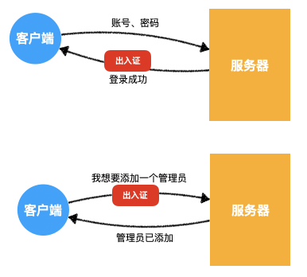

## 一、用户代理

浏览器可以代替用户完成http请求，代替用户解析响应结果，所以我们称之为：

**用户代理 user agent**

在网络层面，对于前端开发者，必须要知道浏览器拥有的两大核心能力：

- 自动发出请求的能力
- 自动解析响应的能力

### 1. 自动发出请求的能力

当一些事情发生的时候，浏览器会代替用户自动发出http请求，常见的包括：

1. **用户在地址栏输入了一个url地址，并按下了回车**

   浏览器会自动解析URL，并发出一个`GET`请求，同时抛弃当前页面。

2. **当用户点击了页面中的a元素**

   浏览器会拿到a元素的href地址，并发出一个`GET`请求，同时抛弃当前页面。

3. **当用户点击了提交按钮`<button type="submit">...</button>`**

   浏览器会获取按钮所在的`<form>`元素，拿到它的`action`属性地址，同时拿到它`method`属性值，然后把表单中的数据组织到请求体中，发出`指定方法`的请求，同时抛弃当前页面。

   > 这种方式的提交现在越来越少见了

4. **当解析HTML时遇到了`<link>  <script> <video> <audio>`等元素**

   浏览器会拿到对应的地址，发出`GET`请求

5. **当用户点击了刷新**

   浏览器会拿到当前页面的地址，以及当前页面的请求方法，重新发一次请求，同时抛弃当前页面。

> 浏览器在发出请求时，会自动附带一些请求头

==重点来了==

从古至今，浏览器都有一个约定：

**当发送GET请求时，浏览器不会附带请求体**

这个约定深刻的影响着后续的前后端各种应用，现在，几乎所有人都在潜意识中认同了这一点，无论是前端开发人员还是后端开发人员。

由于前后端程序的默认行为，逐步造成了GET和POST的各种差异：

1. 浏览器在发送 GET 请求时，不会附带请求体

2. GET 请求的传递信息量有限，适合传递少量数据；POST 请求的传递信息量是没有限制的，适合传输大量数据。
3. GET 请求只能传递 ASCII 数据，遇到非 ASCII 数据需要进行编码；POST 请求没有限制
4. 大部分 GET 请求传递的数据都附带在 path 参数中，能够通过分享地址完整的重现页面，但同时也暴露了数据，若有敏感数据传递，不应该使用 GET 请求，至少不应该放到 path 中
4. POST 不会被保存到浏览器的历史记录中
5. 刷新页面时，若当前的页面是通过 POST 请求得到的，则浏览器会提示用户是否重新提交。若是 GET 请求得到的页面则没有提示。
### 2. 自动解析响应的能力

浏览器不仅能发送请求，还能够针对服务器的各种响应结果做出不同的自动处理

常见的处理有：

1. **识别响应码**

   浏览器能够自动识别响应码，当出现一些特殊的响应码时浏览器会自动完成处理，比如`301、302`

2. **根据响应结果做不同的处理**

   浏览器能够自动分析响应头中的`Content-Type`，根据不同的值进行不同处理，比如：

   - `text/plain`: 普通的纯文本，浏览器通常会将响应体原封不动的显示到页面上
   - `text/html`：html文档，浏览器通常会将响应体作为页面进行渲染
   - `text/javascript`或`application/javascript`：js代码，浏览器通常会使用JS执行引擎将它解析执行
   - `text/css`：css代码，浏览器会将它视为样式
   - `image/jpeg`：浏览器会将它视为jpg图片
   - `application/octet-stream`：二进制数据，会触发浏览器下载功能
   - `attachment`：附件，会触发下载功能
   
     该值和其他值不同，应放到`Content-Disposition`头中。

### 3. 基本流程

> 访问：https://oss.duyiedu.com/test/index.html



## 二、AJAX

> 浏览器本身就具备网络通信的能力，但在早期，浏览器并没有把这个能力开放给JS。
>
> 
>
> 最早是微软在IE浏览器中把这一能力向JS开放，让JS可以在代码中实现发送请求，并不会刷新页面，这项技术在2005年被正式命名为AJAX（**A**synchronous **J**avascript **A**nd **X**ML）

AJAX 就是指在web应用程序中异步向服务器发送请求。

AJAX 最主要的两个特性：

- 在不重新加载页面的情况下发送请求给服务器。
- 接受并使用从服务器发来的数据。

AJAX的优点

- 可以无需刷新页面而与服务器端进行通信
- 允许你根据用户事件来更新部分页面内容

AJAX缺点

- 没有浏览历史，不能回退
- 存在跨域问题

- SEO不友好（爬虫爬不到）

它的实现方式有两种，`XMLHttpRequest 简称XHR`和`Fetch`

以下是两者的对比

| 功能点                   | XHR      | Fetch     |
| ------------------------ | -------- | --------- |
| 基本的请求能力           | ✅        | ✅         |
| 基本的获取响应能力       | ✅        | ✅         |
| 监控请求进度             | ✅        | ❌         |
| 监控响应进度             | ✅        | ✅         |
| Service Worker中是否可用 | ❌        | ✅         |
| 控制cookie的携带         | ❌        | ✅         |
| 控制重定向               | ❌        | ✅         |
| 请求取消                 | ✅        | ✅         |
| 自定义referrer           | ❌        | ✅         |
| 流                       | ❌        | ✅         |
| API风格                  | `Event`  | `Promise` |
| 活跃度                   | 停止更新 | 不断更新  |

### 1.express的简单使用

​	我们使用express来模拟后台服务端，下述步骤124为固定步骤，在后续的操作中我们主要针对步骤3进行修改。

```js
//1. 引入express
const express = require('express');

//2. 创建应用对象
const app = express();

//3. 创建路由规则
// request 是对请求报文的封装
// response 是对响应报文的封装
app.get('/', (request, response)=>{
    //设置响应
    response.send('HELLO EXPRESS');
});

//4. 监听端口启动服务
app.listen(8000, ()=>{
    console.log("服务已经启动, 8000 端口监听中....");
});
```

- 打开终端，键入命令 `node js文件名`，开始监听端口开启服务

### 2.原生AJAX的实现

#### 1.服务端的基本流程

1. 获取元素对象

2. 为元素对象绑定事件

3. 创建XMLHttpRequest对象

4. 发送http请求

   - 初始化请求参数 `open（http请求方法（大写）,URL,是否异步）`
   - 发送请求 `send（body）`
     - get 请求不传 body 参数，只有 post 请求使用

5. 为XMLHttpRequest对象绑定事件，处理服务端响应

   ```js
   xhr.onreadystatechange //当redystate状态值发生变化时触发
   ```

   - 0 (未初始化) or (**请求还未初始化**)
   - 1 (正在加载) or (**已建立服务器链接**)
   - 2 (加载成功) or (**请求已接受**)
   - 3 (交互) or (**正在处理请求**)
   - 4 (完成) or (**请求已完成并且响应已准备好**)

6. 当服务器正常进行响应时处理响应结果

   ```js
   if(xhr.readyState === 4){
       //判断响应状态码 200  404  403 401 500
       // 2xx 成功
       if(xhr.status >= 200 && xhr.status < 300){
   		//处理结果
       }else{
           //异常处理
       }
   }
   ```

   - `xhr.status`  //状态码OK
   - `xhr.statusText` //状态字符串200
   - `xhr.getAllResponseHeaders()` //所有响应头
   - `xhr.response` //响应体

#### 2.GET请求

要求：点击按钮时获取响应内容显示在result框中

- 网页端

  ```js
  //获取button元素
  const btn = document.getElementsByTagName('button')[0];
  const result = document.getElementById("result");
  
  //绑定事件
  btn.onclick = function(){
      //1. 创建对象
      const xhr = new XMLHttpRequest();
  
      //2. 初始化 设置请求方法和 url
      //（HTTP请求方法--大写，url，是否异步）
      xhr.open('GET', 'http://127.0.0.1:8000/server?a=100&b=200&c=300');
  
      //3. 发送
      xhr.send();
  
      //4. 事件绑定 处理服务端返回的结果
      xhr.onreadystatechange = function(){
          //判断 (服务端返回了所有的结果)
          if(xhr.readyState === 4){
              if(xhr.status >= 200 && xhr.status < 300){
                  //设置 result 的文本
                  result.innerHTML = xhr.response;
              }else{
  
              }
          }
      }
  }
  ```

  - URL拼接`?a=100&b=200&c=300`传参

- 服务端

  ```js
  app.get('/server', (request, response) => {
      //设置响应头  设置允许跨域
      response.setHeader('Access-Control-Allow-Origin', '*');
      
      //设置响应体
      response.send('HELLO AJAX');
  
  });
  ```

  - 跨域问题后面会详细说明，此处不做讲解

- 效果

  

#### 3.POST请求

要求：当鼠标移入result框中时获取响应内容显示在result框中

- 网页端

  ```js
  const result = document.getElementById("result");
  result.addEventListener("mouseover", function(){
      const xhr = new XMLHttpRequest();
      xhr.open('POST', 'http://127.0.0.1:8000/server');
      
      //设置请求头
      xhr.setRequestHeader('Content-Type','application/x-www-form-urlencoded');
      xhr.setRequestHeader('name','ggbond');
      
      xhr.send('a=100&b=200&c=300');//传参
      xhr.onreadystatechange = function(){
          if(xhr.readyState === 4){
              if(xhr.status >= 200 && xhr.status < 300){
                  result.innerHTML = xhr.response;
              }
          }
      }
  });
  ```

  - 设置请求头部分为了解决跨域问题，后续统一讲解

- 服务端

  ```js
  //可以接收任意类型的请求 
  app.all('/server', (request, response) => {
      //设置响应头  设置允许跨域
      response.setHeader('Access-Control-Allow-Origin', '*');
  
      //响应头
      response.setHeader('Access-Control-Allow-Headers', '*');
  
      //设置响应体
      response.send('HELLO AJAX POST');
  });
  ```

- 效果


#### 4.服务端响应json格式的数据

- 服务端

  ```js
  app.all('/json-server', (request, response) => {
      //设置响应头  设置允许跨域
      response.setHeader('Access-Control-Allow-Origin', '*');
      response.setHeader('Access-Control-Allow-Headers', '*');
  
      //响应一个数据
      const data = {
          name: 'wahaha'
      };
  
      //对对象进行字符串转换
      let str = JSON.stringify(data);
  
      response.send(str);
  });
  ```

- 网页端

  1. 手动对数据进行转化

     ```js
     let data = JSON.parse(xhr.response);
     result.innerHTML = data.name;
     ```

  2. 自动转换

     ```js
     //设置响应体数据的类型
     xhr.responseType = 'json';
     result.innerHTML = xhr.response.name;
     ```

- 自动转换结果

  

#### 5.ie缓存问题

旧版的ie浏览器会自动将ajax的响应缓存起来，导致服务器端的数据变化网页端无法进行同步更新。

- 解决方案

  在初始化http请求参数时给URL添加如下参数：

  ```js
  xhr.open("GET",'http://127.0.0.1:8000/ie?t='+Date.now());
  ```

  - Date.now()获取的时间戳每时每刻都不相同，则浏览器将这样的请求视为不同的请求而不会读入缓存

- 效果

  

#### 6.超时与网络异常

- 超时设置

  ```js
  //超时设置 2s 设置
  xhr.timeout = 2000;
  
  //超时回调
  xhr.ontimeout = function(){
      alert("网络异常, 请稍后重试!!");
  }
  ```

  - 服务端使用`setTimeout`模拟耗时较长的操作

  - 效果

    

- 网络异常设置

  ```js
  //网络异常回调
  xhr.onerror = function(){
      alert("你的网络似乎出了一些问题!");
  }
  ```

  - 使用浏览器自带的调试器模拟离线操作

    

#### 7.取消请求

- 网页端

  ```js
  const btns = document.querySelectorAll('button');
  let xhr = null;
  btns[0].onclick = function(){
      xhr = new XMLHttpRequest();
      xhr.open("GET",'http://127.0.0.1:8000/delay');
      xhr.send();
  }
  
  // abort 取消请求
  btns[1].onclick = function(){
      xhr.abort();
  }
  ```

- 效果

  

#### 8.重复请求问题

当多次点击发送请求时会增加服务器的负担，因此可以将多次重复的请求默认只获取一次

- 网页端

  ```js
  const btns = document.querySelectorAll('button');
  let x = null;
  
  //标识变量
  let isSending = false; // 是否正在发送AJAX请求
  btns[0].onclick = function(){
      //判断标识变量
      if(isSending) x.abort();// 如果正在发送, 则取消该请求, 创建一个新的请求
  
      x = new XMLHttpRequest();
      
      //修改 标识变量的值
      isSending = true;
  
      x.open("GET",'http://127.0.0.1:8000/delay');
      x.send();
      x.onreadystatechange = function(){
          if(x.readyState === 4){
              //修改标识变量
              isSending = false;
          }
      }
  }
  
  // abort
  btns[1].onclick = function(){
      x.abort();
  }
  ```

  

- 效果



### 3.axios-AJAX的实现

github地址: [https://github.com/axios/axios](https://github.com/axios/axios)

首先npm安装axios或者直接用script引用静态资源

```sh
npm i axios
```

```html
<script src="https://cdn.jsdelivr.net/npm/axios/dist/axios.min.js"></script>
```

- jsdeliver是一个国外的静态资源网站，也可以改用其他国内的资源以提升访问速度

#### 1.get请求

- `axios.get(url[,config])`
- 函数返回结果是一个`promise`对象，用`then`回调处理

```js
axios.defaults.baseURL = 'http://127.0.0.1:8000/';
axios.get('/axios-server', {
    //请求参数（加在url后面）
    params: {
        id: 100,
        vip: 7
    },
    //请求头
    headers: {
        name: 'wahaha',
        age: 20
    }
}).then(value => {
    console.log(value);
});
```

- **请求参数、头信息**



- **控制台信息**

  

#### 2.POST请求

- `axios.post(url[,data[,config]])`

- 网页端

  ```js
  axios.post('/axios-server', {//请求体
      username: 'admin',
      password: 'admin'
  }, {
      //请求参数 
      params: {
          id: 200,
          vip: 9
      },
  
      //请求头参数
      headers: {
          height: 180,
          weight: 180,
      }
  });
  ```

#### 3.通用方法

- 网页端

  ```js
  axios.defaults.baseURL = 'http://127.0.0.1:8000/';
  axios({
      //请求方法
      method : 'POST',
  
      //url
      url: '/axios-server',
  
      //url参数
      params: {
          vip:10,
          level:30
      },
  
      //头信息
      headers: {
          a:100,
          b:200
      },
  
      //请求体参数
      data: {
          username: 'admin',
          password: 'admin'
      }
  }).then(response=>{
      //响应状态码
      console.log(response.status);
      //响应状态字符串
      console.log(response.statusText);
      //响应头信息
      console.log(response.headers);
      //响应体
      console.log(response.data);
  })
  ```

### 4.fetch-AJAX的实现

fetch：window的全局对象

文档地址：[https://developer.mozilla.org/zh-CN/docs/Web/API/WindowOrWorkerGlobalScope/fetch](https://developer.mozilla.org/zh-CN/docs/Web/API/WindowOrWorkerGlobalScope/fetch)

- 网页端

  ```js
  fetch('http://127.0.0.1:8000/server-fetch?a=100&b=100', {
      // 请求方法
      method: 'POST',
      // 请求头
      headers: {
          c: 300,
          d: 400
      },
      // 请求体
      body: 'e=500&f=600'
  }).then(response => {
      //指定响应的返回类型
      // return response.text();
      return response.json();
  }).then(response=>{
      console.log(response);
  });
  ```

## 三、实战

### 1. 请求并获取响应数据

请求地址：https://study.duyiedu.com/api/herolist

请求方法：GET

响应类型：application/json

响应结果：王者荣耀英雄数据

### 2. 上传文件并监控进度

#### 准备工作：启动本地文件上传服务器

**如果没有安装node**

1. 下载安装node，https://nodejs.org/zh-cn/

2. 打开命令行工具，设置淘宝源

   ```shell
   npm config set registry https://registry.npm.taobao.org
   ```

**安装依赖**

1. 在命令行进入`upload-server`目录
2. 运行`npm i`

**启动服务器**

1. 在命令行进入`upload-server`目录
2. 运行`npm start`

#### 上传接口

请求地址：`http://localhost:9527/upload/single`

请求方法：`POST`

消息格式：`multipart/form-data`

字段名称：`avatar`

允许的后缀名：`['.jpg', '.jpeg', '.bmp', '.webp', '.gif', '.png']`

最大尺寸：`1M`

响应格式：`JSON`

响应结果示例：

```json
// 成功
{
  "data": "文件的访问地址"
}
// 失败：后缀名不符号要求
{
  "errCode": 1,
  "errMsg": "后缀名不符合要求"
}
// 失败：文件过大
{
  "errCode": 2,
  "errMsg": "文件过大"
}
```


### 3. 登录和鉴权

由于HTTP协议的特点，每次「请求-响应」都是独立的，这就会导致身份信息丢失的问题




这个问题可以使用`token`令牌解决



在使用AJAX时可以按照这样一种通用模式处理：

1. 在处理响应结果时，只要服务器给我的响应头中包含了`token`，就将其保存在`localStorage`中
2. 在请求时，只要`localStorage`中有`token`，就将其代入到响应头发送到服务器。

#### 接口参考

登录：https://yapi.duyiedu.com/project/72/interface/api/105

获取账号信息：https://yapi.duyiedu.com/project/72/interface/api/114

获取聊天记录：https://yapi.duyiedu.com/project/72/interface/api/117

发送聊天消息：https://yapi.duyiedu.com/project/72/interface/api/120

## 思考

不要写代码，思考一个问题：

你开发了一个网站，你能否在你的网站中写入一段JS脚本，获取淘宝网站保存的`localStorage`的值？

如果你觉得应该进行限制，那么使用怎样的限制规则是合理的？
