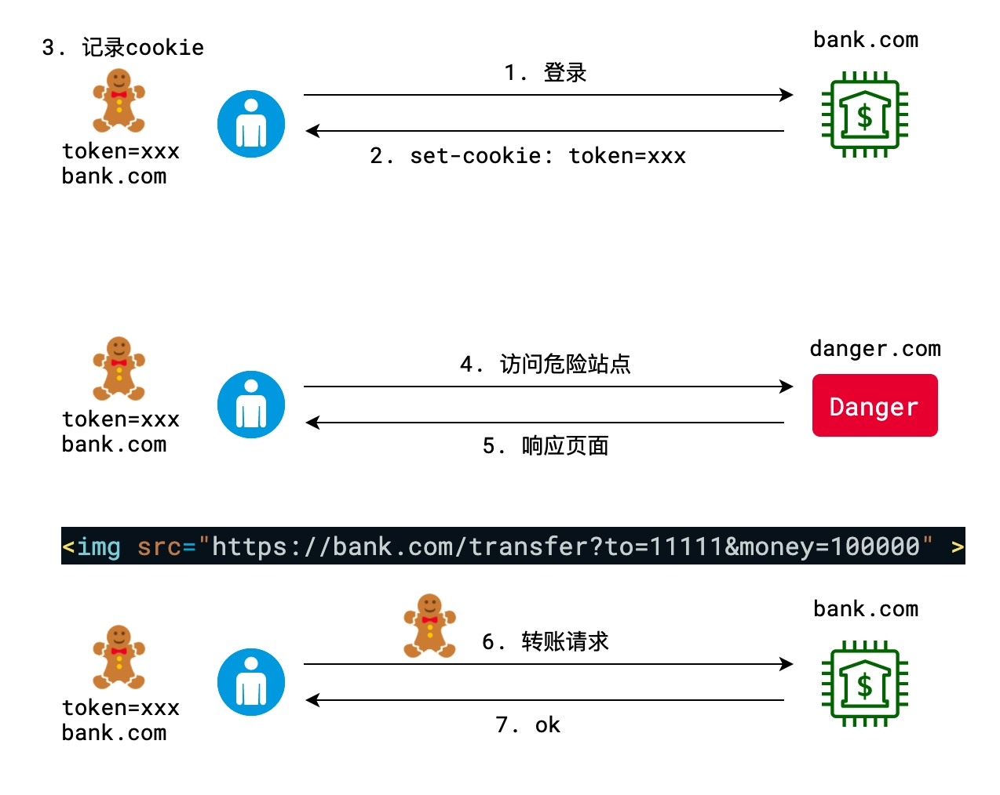

# CSRF攻击

**跨站请求伪造（Cross-site request forgery）**，也被称为 **one-click attack** 或者 **session riding**，通常缩写为 **CSRF** 或者 **XSRF**， 是一种挟制用户在当前已登录的Web应用程序上执行非本意的操作的攻击方法。跟跨站脚本（XSS）相比，**XSS 利用的是用户对指定网站的信任**，**CSRF 利用的是网站对用户网页浏览器的信任**。

假设你正在使用一个银行网页进行转账操作，攻击者可以通过以下步骤进行CSRF攻击：

1、攻击者创建一个恶意网站，并在其中嵌入一个针对银行应用程序的攻击脚本。

2、攻击者向你发送一封包含恶意网站链接的电子邮件,图片或者社交媒体消息，并诱导你点击链接。

3、当你打开恶意网站时，攻击脚本会向银行应用程序发送一个伪造的转账请求，请求中包含转账金额和接收方账户信息。

4、如果你已经在银行应用程序中登录，攻击脚本可以利用你的身份信息来伪造合法的请求，银行应用程序会认为请求是合法的，并将转账请求发送到服务器进行处理。

5、如果攻击成功，攻击者就可以利用你的银行账户进行转账操作，从而窃取你的资金。

## 防御手段

- 验证来源：在服务器端对请求进行验证，判断请求的来源是否合法，如果请求不是来自同一域名下的站点，则拒绝请求。

- Token验证：在用户登录时，为用户生成一个随机的Token，并将Token存储在Cookie或者LocalStorage中，每次用户提交请求时，将Token作为参数发送到服务器端，服务器端验证Token是否合法，如果不合法，则拒绝请求。不过这种方式其实还是不安全，很容易被XSS攻击，窃取Cookie和LocalStorage中的数据

- `SameSite Cookie`属性：在设置Cookie时，可以将SameSite属性设置为Strict或者Lax，防止 ==跨站点== Cookie攻击。

>  SameSite属性是一个用于设置cookie的属性，它用于控制跨站点请求时是否发送cookie。SameSite属性有三个可选值，分别是"Strict"、"Lax"和"None"。
>
> 1. SameSite=Strict：
>    - 设置为Strict时，浏览器将只在请求与当前网站的域名完全匹配时发送cookie。
>    - 当前网站的域名必须与请求的域名完全匹配，包括协议和端口。
>    - 这种设置可以提供最高级别的安全性，防止所有的跨站点请求中的cookie泄露。
> 2. SameSite=Lax：
>    - Lax将在导航的GET请求和跨站点POST请求中发送cookie，但对于所有的第三方请求（如图片、链接等）则不会发送cookie。
>    - 通过在用户导航到目标网站时发送cookie，并在来自第三方网站的POST请求时发送cookie，提供了基本的防御措施，以防止跨站点请求伪造攻击（CSRF）等。
> 3. SameSite=None：
>    - None允许在所有情况下都发送cookie，无论是跨站点的导航、POST请求还是第三方请求。
>    - 同时需要配合Secure属性，即只有在安全的HTTPS连接下才会发送cookie。否则，浏览器将忽略这个设置。
>    - 这种设置通常用于需要在不同域名之间共享cookie的场景，如单点登录（SSO）。

- 验证码：在表单中添加验证码，要求用户在提交表单前必须输入正确的验证码，从而防止攻击者构造伪造的表单进行攻击。

- HTTP Referer：在服务器端验证请求的Referer头部，确保请求来自合法的来源。但是Referer头部可以被伪造，不是一种可靠的防御方式。