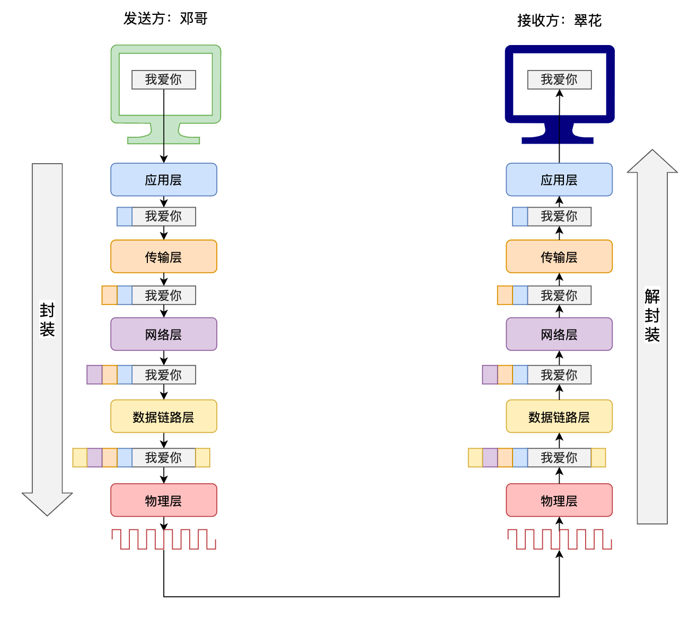
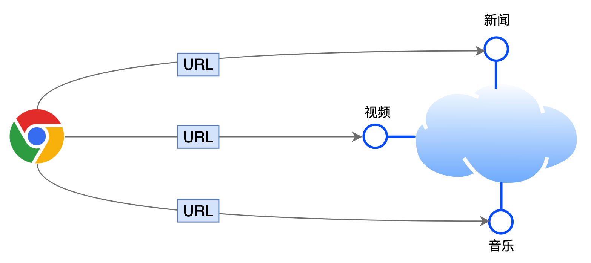
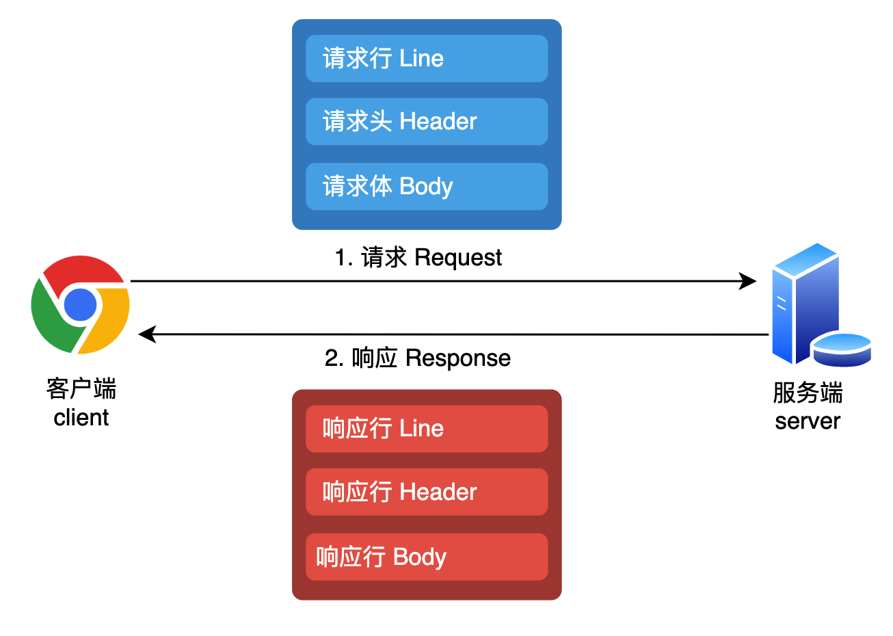
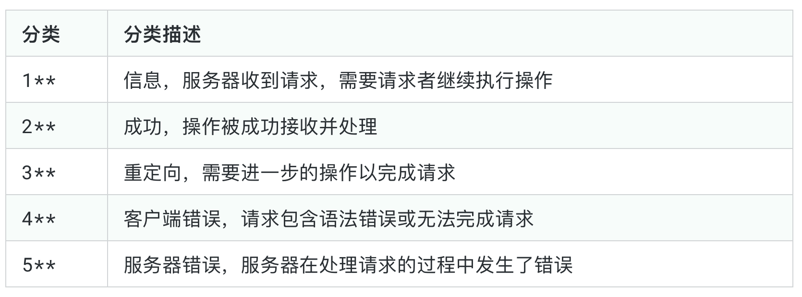

## 一、分层模型

### 1. 分层的意义

当遇到一个复杂问题的时候，可以使用分层的思想把问题简单化

比如，你有半杯82年的可乐，想分享给你的朋友王富贵，但你们已经10年没有联系了。要完成这件事，你可能要考虑：

- 我用什么装可乐？

  可能的方案：塑料瓶、玻璃瓶、煤气罐

- 怎么保证可乐始终处于低温？

  可能的方案：保温杯、小冰箱、冰盒

- 如何保证可乐不被运输的人偷喝？

  可能的方案：封条、在上面写「毒药」

- 如何获取王富贵的地址？

  可能的方案：报案失踪、联系私人侦探、联系物流公司的朋友

- 如何运输？

  可能的方案：自行车、汽车、火车、高铁、飞机、火箭

这就形成了一个分层结构

  


从常理出发，我们可以得出以下结论：

- 每层相对独立，只需解决自己的问题
- 每层无须考虑上层的交付，仅需把自己的结果交给下层即可
- 每层有多种方案可供选择，选择不同的方案不会对上下层造成影响
- 每一层会在上一层的基础上增加一些额外信息

### 2. 五层网络模型

网络要解决的问题是：**两个程序之间如何交换数据**。

这是一个非常复杂的问题，因为两个程序有可能出现在不同的设备上。

面对复杂的问题，可以使用分层的方式来简化。

经过不断的演化，网络最终形成了五层模型：


### 3. 数据的传输



### 4. 四层、五层、七层


## 二、应用层协议

### 1. URL

URL（uniform resource locator，统一资源定位符）用于定位网络服务



URL是一个固定格式的字符串


它表达了：

从网络中 ==哪台计算机（domain）== 中的 ==哪个程序（port）== 寻找 ==哪个服务（path）== ，并注明了获取服务的 ==具体细节（query）== ，以及要用什么样的 ==协议通信（schema）==

这里面包含了一些细节：

- 当协议是`http`端口为`80`时，端口可以省略
- 当协议是`https`端口为`443`时，端口可以省略
- `schema`、`domain`、`path`是必填的，其他的根据具体的要求填写

### 2. HTTP

超文本传输协议（Hyper Text Transfer Protocol，*HTTP*）是一个广泛运用于互联网的应用层协议。

99%的情况下，前端开发者接触的都是HTTP协议。

该协议规定了两个方面的内容：

- **传递消息的模式**
- **传递消息的格式**

#### 1. 传递消息的模式


HTTP使用了一种极为简单的消息传递模式，「**请求-响应**」模式

发起请求的称之为客户端，接收请求并完成响应的称之为服务器。

「请求-响应」完成后，一次交互结束。

#### 2. 传递消息的格式



HTTP的消息格式是一种纯文本的格式，文本分为三个部分：

```
请求行
请求头

请求体
```

**具体每一部分写什么内容，要看具体的服务要求**

#### 3. 试一试

有非常多的工具可以发送http请求，这里推荐一个非常直观的工具

1. 安装`vscode`插件`REST Clinet`

   

2. 新建文件`xxx.http`

3. 编写请求文本

   ```http
   POST /api/user/login HTTP/1.1
   Host: study.duyiedu.com
   Content-Type: application/json
   
   {
     "loginId":"admin",
     "loginPwd":"123123"
   }
   ```

4. 发送请求

#### 4. 熟悉关键信息

##### 请求方法

请求行中的第一个单词是请求方法

**在HTTP协议中，请求方法仅有语义的区别**，只是表达了这次请求的「愿望」。

> 关于请求方法的协议原文见 [HTTP/1.1规范RFC7231-Chapter4](https://www.rfc-editor.org/rfc/rfc7231.html)
>
> 
>
> 

比如`GET`表达了客户端想要获取一些东西，`POST`表达了客户端想要提交一些东西

常见的请求方法有：

- `GET`：获取
- `POST`：提交
- `PUT`：修改
- `DELETE`：删除

**具体在开发中应该选择什么请求方法，一定是看服务方的要求**

通常情况下：

- 获取数据一般使用`GET`
- 提交数据一般使用`POST`
- 各种静态资源的获取，一般使用`GET`

##### 请求头 - `Host`

`Host`标注了`URL`地址中的`Domain + Port`

示例：

```
Host: study.duyiedu.com
```

##### 请求头 - `Content-Type`

`Content-Type`标注了附带的请求体是什么格式

比如，请求体的数据为`loginId:admin, loginPwd:123456`，请求体可以用不同的格式发出

```http
Content-Type: application/x-www-form-urlencoded

loginId=admin&loginPwd=123123
```

```http
Content-Type: application/json

{ "loginId": "admin", "loginPwd": "123123" }
```

```http
Content-Type: multipart/form-data; boundary=----WebKitFormBoundaryraPtlntBIqy4X2Ho

------WebKitFormBoundaryraPtlntBIqy4X2Ho
Content-Disposition: form-data; name="loginId"

admin
------WebKitFormBoundaryraPtlntBIqy4X2Ho
Content-Disposition: form-data; name="loginPwd"

123456
------WebKitFormBoundaryraPtlntBIqy4X2Ho--
```

- 一般用于文件上传，boundary指的是中间的分割符

##### 响应码

响应码（状态码、消息码）是响应行中的一个数字，后面往往跟上一个对应的单词，用于表达服务器对这个响应的整体「**态度**」

常见的响应码有：



常见的状态码有：

1. 200 OK：一切正常。

2. 301 Moved Permanently：资源已被永久重定向。

   ```你的请求我收到了，但是呢，你要的东西不在这个地址了，我已经永远的把它移动到了一个新的地址，麻烦你取请求新的地址，地址我放到了响应头的Location中了```

   > 试试请求：www.douyutv.com

3. 302 Found：资源已被临时重定向。

   ```你的请求我收到了，但是呢，你要的东西不在这个地址了，我临时的把它移动到了一个新的地址，麻烦你取请求新的地址，地址我放到了请求头的Location中了```

4. 304 Not Modified：文档内容未被修改。

   ```你的请求我收到了，你要的东西跟之前是一样的，没有任何的变化，所以我就不给你结果了，你自己就用以前的吧。啥？你没有缓存以前的内容，关我啥事```

5. 400 Bad Request：语义有误，当前请求无法被服务器理解。

   ```你给我发的是个啥啊，我听都听不懂```

6. 403 Forbidden：服务器拒绝执行。

   ```你的请求我已收到，但是我就是不给你东西```

7. 404 Not Found：资源不存在。

   ```你的请求我收到了，但我没有你要的东西```

8. 500 Internal Server Error：服务器内部错误。

   ```你的请求我已收到，但这道题我不会，解不出来，先睡了```

##### 响应头 - `Content-Type`

`Content-Type`标注了附带的响应体是什么格式

常见的值有：

1. `text/plain`: 普通的纯文本
2. `text/html`：html文档
3. `text/javascript` 或 `application/javascript`：js代码
4. `text/css`：css代码
5. `image/jpeg`：jpg图片
6. `attachment`：附件
7. 其他`MIME`类型

## 三、答疑环节

### 长连接

复用创建好的TCP连接，节省创建连接的开销

### URL编码

在http的请求和响应中，行和头的部分不允许出现非ASCII字符。当出现非ASCII字符时（比如query携带中文参数），浏览器会自动进行URL编码。

### SSR和CSR

分别指代服务端渲染和客户端渲染。两者之间的差别在于将数据拼接HTML字符串这件事放在服务端还是客户端。

SSR每次请求都会在服务端将页面渲染好再交给客户端，可以减少浏览器的请求次数，一般用于首屏的性能优化。而CSR则相反，虽然首屏加载较慢，但一旦这些请求完成之后，用户和页面之间交互时用户的体验就会好很多。

> 前端进行SSR

